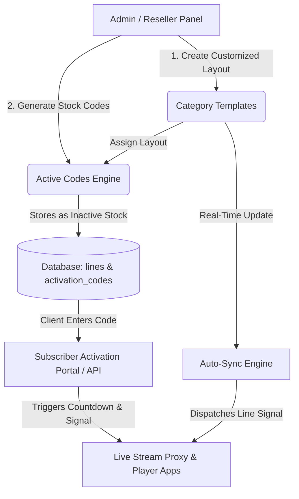
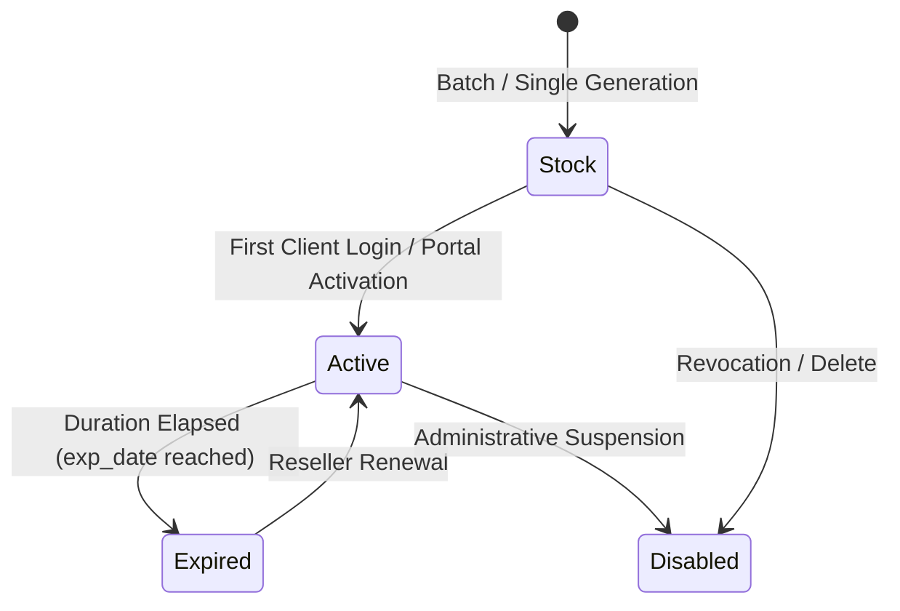
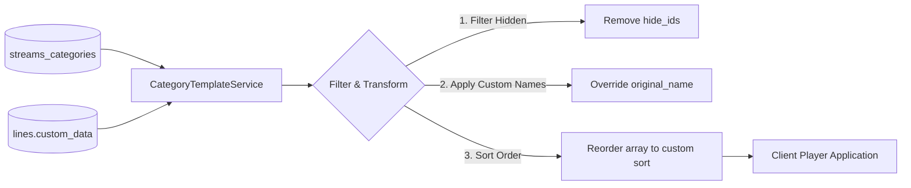
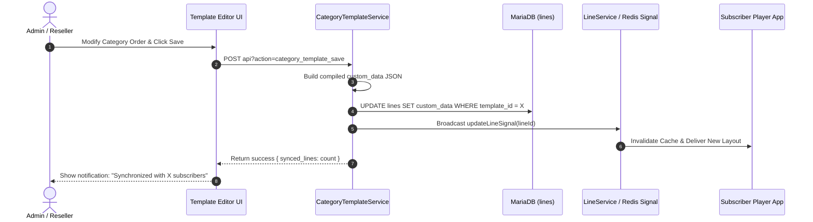

# XC_VM Master Guide: Active Codes & Category Templates

A comprehensive technical and operational guide to **Active Codes (Smart Activation System)** and **Category Templates (Layout Virtualization & Real-Time Sync)** in the XC_VM IPTV Management Platform.

---

# Table of Contents
1. [Executive Architectural Overview](#1-executive-architectural-overview)
2. [Part I: Active Codes System (Smart Activation Codes)](#2-part-i-active-codes-system-smart-activation-codes)
   - [2.1 The Problem It Solves & Architectural Philosophy](#21-the-problem-it-solves--architectural-philosophy)
   - [2.2 Stock Mode & The Delayed Countdown Lifecycle](#22-stock-mode--the-delayed-countdown-lifecycle)
   - [2.3 Subscriber Account Generation & Isolation (`is_activecode`)](#23-subscriber-account-generation--isolation-is_activecode)
   - [2.4 Generation Capabilities & Customization](#24-generation-capabilities--customization)
   - [2.5 Batch Manager & Mass Edit Engine](#25-batch-manager--mass-edit-engine)
   - [2.6 Security, ISP Lock & Device Binding](#26-security-isp-lock--device-binding)
   - [2.7 Client Activation Portal & REST API Integration](#27-client-activation-portal--rest-api-integration)
   - [2.8 Role-Based Permissions (Admin vs. Reseller)](#28-role-based-permissions-admin-vs-reseller)
3. [Part II: Category Templates System (Virtual Layouts & Real-Time Sync)](#3-part-ii-category-templates-system-virtual-layouts--real-time-sync)
   - [3.1 The Concept of Layout Virtualization](#31-the-concept-of-layout-virtualization)
   - [3.2 Core Capabilities & Editor Interface](#32-core-capabilities--editor-interface)
   - [3.3 Template Permissions: System, Shared, and Private](#33-template-permissions-system-shared-and-private)
   - [3.4 The `custom_data` Payload Structure](#34-the-custom_data-payload-structure)
   - [3.5 Real-Time Propagation & Live Cache Signals](#35-real-time-propagation--live-cache-signals)
   - [3.6 Attached Subscribers Metric & Real-Time Tracking](#36-attached-subscribers-metric--real-time-tracking)
4. [Part III: Synergistic Integration: Active Codes + Category Templates](#4-part-iii-synergistic-integration-active-codes--category-templates)
5. [Part IV: Database Schemas & Data Flow Diagrams](#5-part-iv-database-schemas--data-flow-diagrams)
6. [Part V: Administrator & Reseller Operational Manual](#6-part-v-administrator--reseller-operational-manual)

---

# 1. Executive Architectural Overview

Modern IPTV operations demand high agility, rapid distribution, and personalized subscriber experiences without compromising server stability or inflating database operations. 

The **XC_VM Platform** pairs two powerful domain subsystems:
1. **Active Codes System**: A frictionless code-distribution architecture that decouples credit purchases from time consumption. Resellers can generate hundreds or thousands of activation codes in inventory stock; subscription duration starts only when the client actually powers up their device.
2. **Category Templates System**: A zero-overhead category layout engine. Instead of creating redundant streams or modifying global database tables, category ordering, renaming, and hiding are dynamically virtualized per subscriber line and synchronized in real-time across connected players via high-speed daemon signals.

Together, they allow operators to deliver tailored, premium subscription packages branded for specific demographics, resellers, or seasonal events.



---

# 2. Part I: Active Codes System (Smart Activation Codes)

## 2.1 The Problem It Solves & Architectural Philosophy

In legacy IPTV middleware:
- Creating a line immediately starts the expiration timer (`exp_date = time() + duration`), even if the card or code sits in a reseller shop or digital marketplace for weeks.
- Resellers risk losing money on unsold inventory.
- Thousands of dormant test or stock accounts clutter the active subscriber tables, degrading database index performance and slowing down query execution.

**The Active Code Solution**:
Active Codes introduce **Zero-Risk Digital Inventory**. Resellers purchase credits and generate batch codes with predefined bouquets, connections, and category templates. The expiration timer remains frozen until the client connects.

---

## 2.2 Stock Mode & The Delayed Countdown Lifecycle

An Active Code transitions through four clearly defined operational states:

| State | Status Code | Database Representation | Description |
| :--- | :---: | :--- | :--- |
| **Stock / Ready** | `1` | `exp_date = NULL`, `activated_at = NULL` | The code is ready for sale or distribution. The subscription duration is intact and frozen. |
| **Active / Bound** | `2` | `exp_date = NOW() + PackageDuration`, `activated_at = NOW()` | The subscriber has activated the code via the portal or player app. Streaming countdown begins. |
| **Expired** | `3` | `exp_date < NOW()` | The subscription duration has elapsed. Access is restricted until renewed. |
| **Disabled / Banned** | `0` | `admin_enabled = 0` or `enabled = 0` | The code has been manually revoked or flagged for abuse. |



---

## 2.3 Subscriber Account Generation & Isolation (`is_activecode`)

Each Active Code generated is backed by a native subscriber record in the `lines` table, but with a critical distinction:
- **Flagged Attribute**: `lines.is_activecode = 1`
- **Isolation Benefit**: The standard **Manage Lines** (`lines.php`) view filters `is_activecode = 0`. This prevents thousands of stock inventory codes from bloating the primary subscriber management view.
- **Dedicated Management**: Active codes are managed exclusively in their own dedicated portal (`active_codes.php` and `reseller/active_codes.php`), complete with batch filters, export utilities, and mass operations.

---

## 2.4 Generation Capabilities & Customization

When generating codes (single or bulk batch), administrators and resellers can configure:
1. **Quantity & Code Format**:
   - Bulk count (up to 1,000 per batch).
   - Custom prefix (e.g., `VIP-`, `GOLD-`, `PROMO-`).
   - Code length (8 to 16 alphanumeric characters) with cryptographic randomness.
2. **Package & Pricing**:
   - Selection of package defines credit costs and duration (e.g., 1 Month, 3 Months, 12 Months).
   - Resellers have credits automatically deducted. Admins generate without credit limits.
3. **Bouquet Selection**:
   - Defaults to the bouquets bundled with the selected package.
   - Allows fine-grained override to include or exclude specific bouquets (e.g., Sports only, Family only).
4. **Category Template Binding**:
   - Direct assignment of a **Category Template** (`category_template_id`).
   - The generated code inherits the custom category ordering, renames, and hidden categories automatically.
5. **Output Formats**:
   - Enables or restricts specific client outputs: HLS (`m3u8`), MPEG-TS (`ts`), or RTMP.

---

## 2.5 Batch Manager & Mass Edit Engine

Codes are grouped by an automatic Batch Identifier (e.g., `BATCH-2026-A4F1`). This unlocks powerful bulk workflows:
- **Batch Export**: Download credentials in clean TXT, CSV, or formatted M3U playlist lists for direct distribution or printing scratch cards.
- **Mass Edit / Mass Renewal**:
  - Extend expiration dates in bulk across an entire batch.
  - Reassign packages or bouquets in a single operation.
  - Change associated category templates for an entire reseller batch.
- **Mass Deletion & Credit Refund**:
  - Deleting unused stock codes (`status = 1`) automatically refunds the reseller credits, eliminating financial penalty for unsold batches.

---

## 2.6 Security, ISP Lock & Device Binding

Active Codes incorporate enterprise-grade anti-restream and anti-fraud mechanisms:
- **MAC Address Binding**: Optional auto-lock on first activation to lock the code to a single MAG, Enigma2, or Android STB.
- **Max Connections**: Enforced concurrent stream limits (e.g., 1 device, 2 devices, or family multi-room).
- **Allowed IP Whitelist & ISP Lock**: Automatically locks to the client's Internet Service Provider (ISP) upon activation to prevent account sharing.

---

## 2.7 Client Activation Portal & REST API Integration

End-users activate their subscription effortlessly through two channels:

### 1. Web Activation Portal
Subscribers visit the portal (e.g., `http://panel-url/activate`):
- Enter their **Active Code**.
- If MAC-binding is enabled, input their device MAC.
- The portal validates the code, initializes `exp_date`, and returns:
  - Direct M3U Plus download URL.
  - Xtream Codes API login credentials (Server URL, Username, Password).
  - WebTV Player launch button.

### 2. Native Player REST API
Third-party Android, iOS, and Smart TV applications (TiviMate, XCIPTV, IPTV Smarters, etc.) can authenticate using the activation endpoint:
```http
POST /api?action=active_code
Content-Type: application/json

{
    "code": "VIP-9482-1049",
    "mac": "00:1A:79:B4:C2:11"
}
```
**Response**:
```json
{
    "result": true,
    "status": "active",
    "username": "ac_6f8eb703e",
    "password": "ac_pwd_9a12b",
    "exp_date": 1799283600,
    "server_url": "http://stream.domain.com:8080",
    "portal_url": "http://stream.domain.com:8080/c/"
}
```

---

## 2.8 Role-Based Permissions (Admin vs. Reseller)

| Capability | Super Admin | Reseller / Sub-Reseller |
| :--- | :---: | :---: |
| **Credit Consumption** | Free (Unlimited) | Deducted from reseller credit wallet |
| **Target Reseller Assignment** | Can generate on behalf of any reseller | Only for own account and sub-resellers |
| **Stock Deletion Refund** | N/A | Full credit refund for unactivated codes |
| **System Template Access** | Create & assign all templates | Assign system & shared templates |
| **Security Override** | Can bypass ISP lock and device lock | Subject to group security restrictions |

---

# 3. Part II: Category Templates System (Virtual Layouts & Real-Time Sync)

## 3.1 The Concept of Layout Virtualization

In traditional IPTV panels, category sorting and naming are **global**. If an administrator moves "Sports" to the top or renames a category, that change affects all users universally. 

**The Category Templates Architecture** solves this through **Virtual Layouts**:
- The master categories in `streams_categories` remain untouched and pristine.
- Customizations (sort order, custom display names, hidden categories) are defined inside a lightweight template and serialized into the subscriber line's `custom_data` column.
- When an end-user device requests the channel list (`/player_api.php?action=get_live_categories`), XC_VM's `CategoryTemplateService` intercepts the response, applies the subscriber's custom template transformations in microseconds, and streams the tailored list to the player.



---

## 3.2 Core Capabilities & Editor Interface

The Category Template Editor (`category_template.php`) provides an intuitive desktop-grade interface:

1. **Native Drag-and-Drop Reordering**:
   - Reorder categories independently across **Live TV**, **Movies (VOD)**, and **TV Series**.
   - Immediate visual feedback with grip handles and floating drop zones.
2. **Custom Category Renaming**:
   - Click the edit pen to assign a bespoke display name (e.g., change `BEIN SPORTS` to `⭐ VIP | BEIN ULTRA`).
   - If left blank, the template seamlessly falls back to the master category name.
3. **Visibility Switch (Hide / Show)**:
   - Toggle categories off with a single click. Hidden categories are completely suppressed from the subscriber's player without modifying bouquet streams.
4. **Bulk Selection Tools**:
   - "Select All Visible", "Hide All", "Invert Selection", and "Reset to Global Order".
5. **Real-Time Search & Filtering**:
   - Instant live search filter to isolate specific categories within huge channel lineups.

---

## 3.3 Template Permissions: System, Shared, and Private

Category templates support enterprise-grade isolation and sharing:

- **System Template (`is_system = 1`)**:
  - Created exclusively by Administrators.
  - Automatically visible to all resellers and sub-resellers across the network.
  - Read-only for resellers (resellers can preview or **Clone** it into their own private template).
- **Shared Template (`is_shared = 1`)**:
  - Created by a Master Reseller.
  - Accessible to all downstream sub-resellers within their distribution tree.
- **Private Template**:
  - Accessible only to the creator. Fully isolated.

---

## 3.4 The `custom_data` Payload Structure

The entire layout configuration is stored as a compact JSON object inside `lines.custom_data`:

```json
{
  "template_id": 7,
  "live_cat": {
    "hide_ids": "14,22,89",
    "renamed": {
      "4": "⭐ VIP | BEIN SPORTS (4K / FHD)",
      "12": "🎬 CINEMA & VIP MOVIES"
    },
    "order": "4,12,1,2,3,5,6,7,8"
  },
  "vod_cat": {
    "hide_ids": "104",
    "renamed": {
      "45": "🔥 TOP TRENDING 2026"
    },
    "order": "45,41,42,43,44"
  },
  "series_cat": {
    "hide_ids": "",
    "renamed": {},
    "order": "70,71,72,73"
  }
}
```

### Architectural Highlights:
- **`template_id`**: Links the line to its parent template for real-time tracking and mass updates.
- **Comma-Delimited Strings**: `order` and `hide_ids` use compact comma-separated representations, minimizing database storage overhead and maximizing JSON parsing throughput.
- **Non-Destructive Overrides**: If a stream category is added in the master database, it automatically appears at the end of the list without breaking existing customer orders.

---

## 3.5 Real-Time Propagation & Live Cache Signals

One of the platform's standout features is **Zero-Delay Layout Propagation**:

1. **Trigger**: When an administrator or reseller edits a template in `category_template.php` and clicks **Save Changes**:
   - The master template items in `category_template_items` are updated.
   - `CategoryTemplateService::syncTemplateToLines($templateId)` executes.
2. **Targeted Line Updates**:
   - The service queries all subscriber lines where `custom_data` contains `"template_id": <id>`.
   - Lines are updated in optimized chunks of 500 records.
3. **Signal Dispatching (`LineService::updateLineSignal`)**:
   - For every attached subscriber line, XC_VM broadcasts a cache invalidation signal via Redis / socket daemon.
   - Streaming proxy nodes and load balancers immediately flush their local line cache.
4. **Player Refresh**:
   - Connected player apps (TiviMate, Smarters, etc.) receive the updated category order on their next channel reload or background sync without requiring line renewal or re-activation.
5. **Operator Feedback**:
   - The editor displays an instant confirmation toast:
     > *"Template saved successfully and synchronized with 42 active subscriber(s)."*



---

## 3.6 Attached Subscribers Metric & Real-Time Tracking

To ensure operators always have full visibility of their distribution:
- **Quadruple Metric Display**:
  In both Admin and Reseller template lists (`category_templates.php`), cards display four balanced KPI metrics:
  1. **Live Categories** (`live_count`)
  2. **Movie Categories** (`vod_count`)
  3. **Series Categories** (`series_count`)
  4. **Subscribers** (`subscriber_count`) — Highlighted in primary blue with `<i class="ti tabler-users"></i>`.
- **Editor Header Counter**:
  Inside `category_template.php`, a prominent header badge displays the exact number of active lines currently utilizing the layout.
- **Direct Link Verification**:
  Administrators can instantly identify orphaned templates (0 users) versus mission-critical templates serving hundreds of paying subscribers.

---

# 4. Part III: Synergistic Integration: Active Codes + Category Templates

The combination of Active Codes and Category Templates delivers an unmatched operational workflow:

```
[ Step 1: Design ]
Admin/Reseller designs a Category Template:
- VIP Sports at the top
- Custom Arabic/English branding
- Adult categories completely hidden

         │
         ▼
[ Step 2: Batch Generation ]
Reseller creates 50 Active Codes:
- Package: 12 Months VIP
- Bouquets: Premium Sports & Entertainment
- Category Template: "VIP Arabic Sports Template" (Assigned)

         │
         ▼
[ Step 3: Stock Inventory ]
50 codes sit safely in reseller inventory.
Credits deducted, but zero expiration countdown.

         │
         ▼
[ Step 4: Client Activation ]
Client purchases a code and enters it in their TV app.
Countdown starts immediately (365 days).
Player receives the tailored "VIP Arabic Sports" category order automatically.

         │
         ▼
[ Step 5: Mid-Subscription Customization ]
Admin reorders categories in "VIP Arabic Sports Template".
The client's TV app refreshes the new layout live in the background!
```

---

# 5. Part IV: Database Schemas & Data Flow Diagrams

### `category_templates` Table
| Column | Type | Attributes | Description |
| :--- | :--- | :--- | :--- |
| `id` | `INT UNSIGNED` | `AUTO_INCREMENT, PRIMARY KEY` | Unique Template ID |
| `owner_id` | `INT` | `INDEX` | Reseller / Admin user ID who created the template |
| `name` | `VARCHAR(255)` | `NOT NULL` | Human-readable template name |
| `is_system` | `TINYINT(1)` | `DEFAULT 0, INDEX` | `1` = System-wide template (Admin only) |
| `is_shared` | `TINYINT(1)` | `DEFAULT 0` | `1` = Shared with downstream sub-resellers |
| `live_count` | `INT UNSIGNED`| `DEFAULT 0` | Cached count of Live categories |
| `vod_count` | `INT UNSIGNED`| `DEFAULT 0` | Cached count of Movie categories |
| `series_count`| `INT UNSIGNED`| `DEFAULT 0` | Cached count of Series categories |
| `created_at` | `DATETIME` | `NOT NULL` | Creation timestamp |
| `updated_at` | `DATETIME` | `NOT NULL` | Last update timestamp |

### `category_template_items` Table
| Column | Type | Attributes | Description |
| :--- | :--- | :--- | :--- |
| `id` | `INT UNSIGNED` | `AUTO_INCREMENT, PRIMARY KEY` | Record ID |
| `template_id` | `INT UNSIGNED` | `INDEX, FK -> category_templates` | Parent Template ID |
| `category_id` | `INT` | `INDEX` | Foreign Key to `streams_categories.id` |
| `category_type`| `ENUM(...)` | `'live','movie','series'` | Media type section |
| `sort_order` | `INT` | `DEFAULT 0` | Custom display sort order |
| `is_visible` | `TINYINT(1)` | `DEFAULT 1` | `1` = Visible, `0` = Hidden from player |
| `custom_name` | `VARCHAR(255)` | `NULL` | Custom display override name (or null) |

### Key Columns in `lines` Table
- `is_activecode` (`TINYINT(1) DEFAULT 0`): Isolates active codes from regular lines.
- `custom_data` (`MEDIUMTEXT`): Stores the compiled JSON object with `"template_id": X` and layout mappings.

---

# 6. Part V: Administrator & Reseller Operational Manual

### Creating a Branded Template
1. Navigate to **Service Setup → Category Templates** (`category_templates`).
2. Click **Add Template**.
3. Name your template (e.g., `VIP European Sports Layout`).
4. Toggle **Share with Sub-Resellers** if you want your distributors to use it.
5. In the **Live TV** tab:
   - Drag key sports categories to positions 1 through 5.
   - Click the pencil icon to rename categories with custom emojis or clean branding.
   - Turn off the switch for any categories you want hidden.
6. Click **Save Changes**. Note the live notification confirming save success.

### Generating Active Codes with the Template
1. Navigate to **Lines → Active Codes** (`active_codes`).
2. Click **Generate Codes**.
3. Select the number of codes (e.g., `10`), prefix (`PRO-`), and desired package.
4. In the **Category Template** dropdown, select your newly created `VIP European Sports Layout`.
5. Click **Generate**.
6. Export the batch in TXT/CSV or copy individual codes for customer delivery.

### Updating Layouts on Active Lines
1. Return to **Category Templates** and click **Edit** on your template.
2. Rearrange categories, rename a section, or hide newly obsoleted channels.
3. Click **Save Changes**.
4. The system updates all connected customer lines in real time and displays:
   > *"Template saved successfully and synchronized with X active subscriber(s)."*
5. Customers' applications will reflect the new order without any intervention.

---

*Document Revision: 2.1 — XC_VM Platform Unified Engineering Standards*
