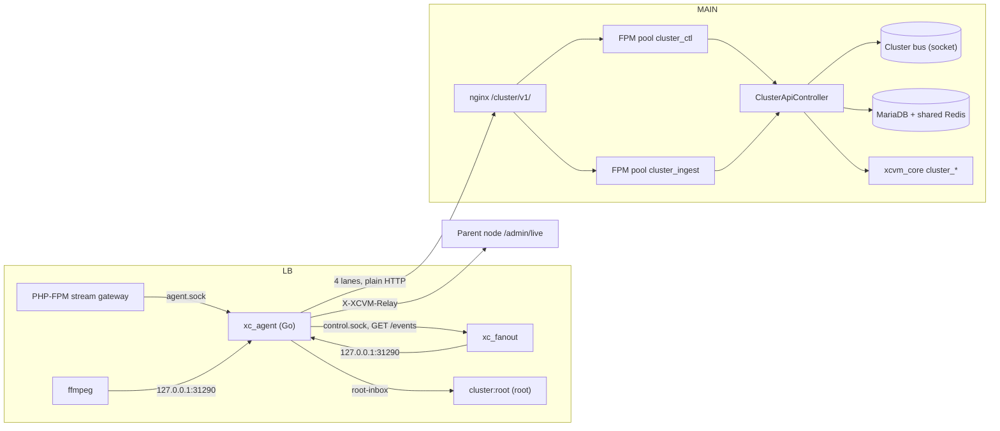
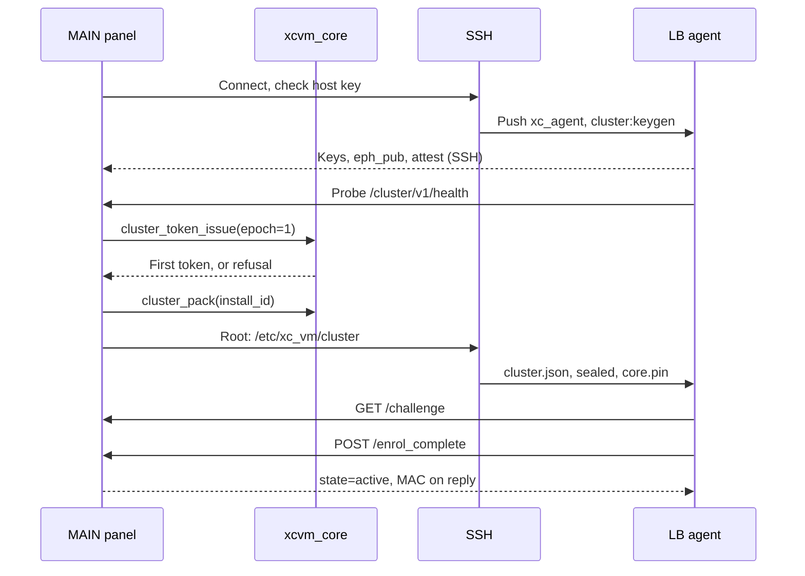

# MAIN ↔ LB API communication — implementation plan

Sep 21, 2026 · @Pedro

LB nodes stop reaching MAIN's MySQL and Redis: every exchange moves to an authenticated API whose token derives from the license key, rotates on an interval set in Settings, is first issued at installation, and stops being issued when the license is revoked.

This tab is the condensed plan. The complete revision 3 (≈32,000 words, with file references and the review log) is in Full plan (revision 3). This tab also carries 28 consistency corrections made after revision 3; where the two differ, this tab wins.

## 1. Summary

The plan replaces LB access to MAIN's MySQL and Redis with one signed, encrypted cluster API, over plain HTTP by default. MAIN's data model is unchanged; `server_id` always comes from the authenticated node.

Today LBs use MAIN's panel database credentials, and MAIN calls LBs' plain-HTTP `/api` guarded by one static password, `live_streaming_pass`. That password travels in URLs and is the root key of every viewer token. `\XC_VM::db_grant` is the only tamper-resistant licence gate; most panels have no real certificate.

### Key decisions

| Area | Decision |
| --- | --- |
| Listener | Only LBs connect, to `http://<MAIN IP>:<http_broadcast_port>/cluster/v1/<op>` on two dedicated FPM pools; optional `cluster_api_port` (0 = reuse, colliding values refused). LBs usually reach that port already, so normally no new firewall rule is needed. Enrolment checks this reach from the LB before issuing any token. |
| HTTPS (optional) | `cluster_transport=auto` lists HTTPS first only if MAIN's live certificate passes a self-probe. The agent falls back to HTTP on connect, timeout or TLS errors; `https_required` is opt-in. |
| Lanes and commands | Four keep-alive HTTP/1.1 lanes (`poll`, `ctl`, `p0`, `bulk`), one request in flight each; P0 never waits behind bulk. Commands use a 25 s long-poll woken by the cluster bus (`ClusterBus`), a separate Redis on MAIN reachable only by unix socket. The fallback short poll never holds a DB connection. |
| Signing | Requests and PHP-originated responses are MAC'd with node-token keys; nothing changes state before a MAC verifies. An unverifiable response is a transport error, never a policy change. |
| Encryption | Every body except `/health` and `/challenge`: AES-256-GCM per epoch and direction (XCVM-BOX-v1). Pre-token bodies: XCVM-SEAL-v1 to MAIN's static X25519 panel box key. Tokens, the replica and stream bundles are sealed to the node and panel-signed. |
| Attacker view | On the cluster API, an active MITM cannot forge, replay or reorder anything, nor downgrade protocol version or policy. Outside `https_required` it can force the HTTP transport, which BOX and MAC still protect; relay bytes are excluded. For mode-2 nodes after the password rotations, a passive sniffer sees only node ids, op names, sizes and timing. |
| Token | Minted only in `xcvm_core` from the panel root secret, licence binding and a per-epoch ephemeral X25519 exchange (forward secrecy). Expiry is inside the MAC; lifetime cap 25 h 15 m. `lb_token_rotation_min`: default 60, bounds 5–1440 min, grace `clamp(L/4, 5, 60)` min. Refresh at 0.5·L (about every 30 min at the default; token valid L + G = 75 min). |
| First token | Issued over SSH at install, sealed to an LB-generated keypair. The LB pins MAIN's Ed25519 panel key via SSH or a console-typed enrolment code. Fresh installs verify the SSH host key when an expected key is supplied, and otherwise trust it on first use, as today. Enrolling existing LBs requires a verified host key or the console SAS. |
| Licence revocation | `xcvm_core` refuses to issue tokens, refresh, re-key, enrol, lease or sign capability-granting records. It derives each record's class from a closed registry of signature tags, so PHP cannot relabel records. Kills, stops and fences stay signable. |
| Revocation timing | A MAIN-signed lease (cap 26 h) is judged on rollback-resistant clocks. Graceful (default) stops a reachable fleet ≤ \~85 min after detection; hard, about 12 min. Re-licensing recovers it in ≤ \~2 min, without SSH. |
| Viewer-token secret | `live_streaming_pass` and `OPENSSL_EXTRA` are rotated once no node uses the legacy link, and again at lockdown. |
| LB runtime | A separate Go `xc_agent` (score 81.0 vs all-PHP 68.4) owns the MAIN link, tokens, crypto, telemetry, connection journal, fanout reconciliation and loopback relay proxy. PHP keeps the viewer gate, stream specs, workers and root executor, with no remote I/O. |
| Connections | MAIN enforces `max_connections` in `auth.php`, via a reservation that recognises the viewer's own connection. The LB hot path makes no WAN calls; closes arrive via fanout `GET /events` in under 1 s. |
| Replica | R1: allowlisted config, blocklists delta-versioned separately. R2: stream bundles, resynced by section hashes. Both persist on disk and are restored before PHP-FPM serves. |
| Rollout | Node modes 0, 1 and 2, plus per-flow bits including DATAPLANE. From Phase 2, MAIN's ports 3306 and 6379 are open only to nodes still in legacy or hybrid mode. The LB's public `/api` closes at cutover. |
| Cutover gate | Zero SQL and zero Redis connects for 7 days, measured at `Database::db_connect()` and `RedisManager::connect()`. Then come `db_revoke`, a credential-free `config.enc`, stream-secret rotation and lockdown. `db_grant` stays the gate until the extension ships cluster primitives, and cluster crypto fails closed. |
| Data plane | Viewer bytes are unchanged; relays and file pulls use the agent's loopback proxy. Each upstream connect carries a MAIN-signed ticket naming the child's public key and generation, plus a fresh node-key signature. `/xfile` carries an owner-signed digest; plain-HTTP relay bytes have no confidentiality or integrity. |

## 2. Today

An LB has no API link to MAIN: every LB process is a remote client of MAIN's MySQL and Redis, and commands travel over a plaintext `/api` that trusts one cluster-wide password. Eleven code mappers and a completeness critic found these paths (file references are in the working notes).

| Flow | How it works today | Cadence | Authentication today |
| --- | --- | --- | --- |
| Database | Every LB process opens a MySQL connection to MAIN: \~13 cron boots/min, respawning daemons, and every stream request except `segment`/`key`. Credentials sit in `config.enc`, packed by `\XC_VM::config_pack` | Continuous | MySQL user + host grant from `\XC_VM::db_grant` (the licence gate); plaintext |
| Redis | LB connects to MAIN's Redis (`bind *`); `status` copies `settings.redis_password` into `config.enc` | Per request | Shared Redis password; plaintext |
| Heartbeat and telemetry | `watchdog` writes `servers.watchdog_data` / `last_check_ago` (CPU, RAM, disk, per-interface bandwidth, nginx, fanout, connections); `cron:servers` inserts `servers_stats` and hardware inventory | \~5 s / 1 min | Direct DB write |
| Viewer connections | MAIN authenticates the viewer and 302s to the LB with a token encrypted with `live_streaming_pass`; the LB writes the connection into MAIN's Redis (`LIVE`, `LINE#`, `SERVER#`…) or `lines_live` | \~20 Redis + 3–4 MySQL round trips per TS connect; \~17 + 3 per HLS playlist refresh | Direct DB/Redis write |
| Stream state | LB writes `streams_servers` (pid, status, codecs, bitrate, `progress_info` CPU/RSS) on every event; fanout reconcile every \~5 s; `cron:streams` every minute | Per event | Direct DB write |
| Commands, synchronous | MAIN calls `http://<lb>:<http_port>/api` (\~30 actions: start/stop stream, kill pid, close connection, reload nginx, df, ps, getFile…), fire-and-forget, only to nodes with a fresh heartbeat | On admin action | `live_streaming_pass` in query/body + source-IP allowlist; plaintext |
| Commands, queued | `signals` table / Redis `SIGNALS#<id>`: kills and cache work polled every \~1–2 s by the `signals` daemon; reboot, update, services, sysctl, modules polled every minute by root `cron:root_signals` | 1–2 s / 1 min | LB reads MAIN's DB |
| Catalog | LB rebuilds light caches (settings, servers, bouquets, categories, blocklists) from MAIN's DB every minute and on every daemon pass; reads its own `servers` row for ports and limits | 1 min + per pass | Direct DB read |
| Logs | Local spool files drained by minute crons into `lines_activity`, `lines_logs`, `streams_logs`, `streams_errors`, `panel_logs` | 1 min | Direct DB write |
| Files | VOD/subtitle sources and module archives pulled with `/api?action=getFile&password=…` | On demand | `live_streaming_pass` |
| Installation | Root SSH (password) once; `config.enc` uploaded; `db_grant`; later updates arrive as `signals` rows | Once | SSH root password on `argv` |
| Proxies | Proxies POST stats to `/admin/proxy_api` and receive `signals` rows to run as root | 1 min | Source IP only |

What this costs today:

- **MAIN outage stops every LB:** new stream requests exit on the DB connect, crons die at boot and the heartbeat stops. The cache lives on tmpfs, so a rebooted LB fails closed.
- **Exposure:** MySQL 3306 and Redis 6379 listen on all interfaces in plaintext. One static secret authenticates every node and appears in URLs and logs. A compromised LB can read and write the whole database.
- **Stray work on LBs:** global `CleanupCronJob` deletes, TMDb crons, signal purges and GitHub/module egress run on every LB. `cache_handler` starts on LBs and fails with "Unknown command" after opening a DB connection.
- **Stale LB build manifest:** `Public/admin/api.php`, `Public/admin/proxy_api.php` and `Public/stream/auth.php` still ship to LBs because the `www/*` removal paths no longer exist.
- **Existing bug found on the way:** `disallow_2nd_ip_con` in Redis mode fatals in `live.php:268-273`.

## 3. Target architecture

Each LB gets one new Go process, `xc_agent`, as its only client of MAIN. MAIN runs it too, but only as a relay/file proxy. MAIN answers under `/cluster/v1/` in its existing public nginx server, through two new FPM pools. LB PHP keeps the viewer gate but does no remote I/O.

| Node | Component | Status | Role |
| --- | --- | --- | --- |
| MAIN | `location ^~ /cluster/v1/` in the public `server{}` | new | API on `http_broadcast_port` or `cluster_api_port` |
| MAIN | FPM pools `cluster_ctl`, `cluster_ingest` | new | Control ops apart from DB-heavy ingest |
| MAIN | `ClusterApiController` + `Domain/Cluster/*` | new | Auth, BOX, ingest, commands, replica, enrolment, tokens |
| MAIN | `ClusterPool::ensure()`, marker `tmp/cluster_ready` | new | Creates pools on upgrade; panel-signed `503 STARTING` until ready |
| MAIN | `signals` step (1 s), `cron:cluster` (1 min) | new | Node health, retention, licence audit, allowlist, certificates |
| MAIN | Cluster bus Redis on `bin/cluster_bus/cluster.sock` | new | Wakes, nonces, telemetry, reservations; no network access |
| MAIN | Shared Redis (6379), MariaDB (3306) | changed | Connection store; legacy access for mode ≤ 1 only |
| MAIN | `Public/stream/auth.php` + `ConnectionAdmission` | changed | Reserve with `adm`/`adm_uuid` before `mintToken` |
| MAIN | `xc_agent --role=main` (Go) | new | Relay/file proxy; signs digests of files MAIN owns |
| MAIN | `xcvm_core` `cluster_*` API | new (extension) | Tokens, session keys, signing, lease, licence state |
| LB | `xc_agent` (Go), `agent.sock`, `127.0.0.1:31290` | new | Lanes, tokens, telemetry, registry, journal, commands, replica, relay proxy |
| LB | `xc_fanout` | + `GET /events` | Viewer open/close and monitor transitions |
| LB | `console.php cluster:root` (root) | new | Verifies MAIN's Ed25519 `cmd` signature and sequence, then executes |



Every control connection starts at the LB; MAIN→LB control traffic is no longer needed, and viewer bytes keep their direct path.

### Transport

The agent holds four keep-alive HTTP/1.1 lanes, each with one request in flight and no HTTP/2. Every body except `health` and `challenge` is XCVM-BOX-v1 (AES-256-GCM), and every request and PHP response is MAC'd.

| Lane | Carries | Pool |
| --- | --- | --- |
| `poll` | `commands` long-poll (25 s) | `cluster_ctl` |
| `ctl` | hello, heartbeat (2 s), ack, token ops, challenge, `conn_admit` | `cluster_ctl` |
| `p0` | P0 `events`, one batch in flight | `cluster_ingest` |
| `bulk` | P1/P2 events, config, streams, snapshots, `rpc_result`, content, artefact | `cluster_ingest` |

| Pool | `max_children` | Timeout (s) |
| --- | --- | --- |
| `cluster_ctl` | `2·nodes + 24` | 60 |
| `cluster_ingest` | `min(2·cluster_ingest_concurrency + 8, floor(0.25 · MariaDB max_connections))` | 90 |

A held `commands` handler waits in 1 s `BLPOP` slices without a DB connection. A command arrives in under 100 ms plus one-way latency. With the bus down it short-polls (`retry_after_ms:1000`).

nginx applies `limit_req` 100 r/s per TCP peer (burst 400, status 429), `client_max_body_size 8m` and `gzip off`. Its own 429, 413, 502, 504 and 404 carry no MAC; the agent treats them as transport errors with capped backoff. Reconnects use full jitter; the first after a MAIN restart is spread over `max(5 s, N/10 s)`.

**Legacy caveat.** Shared Redis and MariaDB stay reachable for legacy nodes, with three safeguards:

- An iptables allowlist opens 3306/6379 only to mode ≤ 1 nodes and proxies. It is opt-in (`cluster_db_allowlist`), and it keeps every proxy, because which proxies still hold a grant is not recorded.
- `CONFIG`, `DEBUG`, `SHUTDOWN`, `SLAVEOF`, `REPLICAOF`, `MIGRATE` and `MODULE` are renamed to `""` (removed) on the shared Redis. `FLUSHALL`, `FLUSHDB` and `EVAL` stay, since the panel uses them.
- `redis_password` and the LB DB grant password rotate when a node leaves mode ≤ 1 and at lockdown (Phase 9).

Until those rotations, legacy nodes send Redis `AUTH` and SQL in cleartext, so confidentiality holds only for mode-2 nodes. Per-node scoping of the grant password by `db_grant` is (undetermined).

### Endpoints and HTTPS

The default URL is `http://<private_ip or server_ip>:<http_broadcast_port>/cluster/v1/<op>`; enrolment verifies the LB can reach it. An optional plain-HTTP `cluster_api_port` is refused on port collisions and applied only after `nginx -t` passes. It, or the HTTPS port, must be opened LB→MAIN. After lockdown, 3306 and 6379 are closed from outside.

**HTTPS is optional.** `cluster_transport` decides when `main_urls` lists `https_broadcast_port`:

| `cluster_transport` | HTTPS listed |
| --- | --- |
| `auto` (default) | First, only when MAIN's certificate verifies in a self-probe with over 7 days left |
| `https_preferred` | Whenever `enable_https` is 1 or 2 |
| `http` | Never |
| `https_required` | Opt-in; HTTP refused except `GET /challenge`; needs the self-probe and every active node reporting HTTPS working |

In every mode, HTTPS needs a non-IP name in `servers.domain_name` (the `tls_server_name`). The agent dials by IP, verifies against system CA roots and never pins an SPKI. `cron:cluster` re-checks hourly and alerts 14 days before expiry.

Outside `https_required`, any connect, timeout or TLS error makes the agent fall back to HTTP and retry HTTPS every 10 minutes.

Under `https_required`, while HTTPS fails, agents poll the panel-signed `challenge` over HTTP every 60 s. An admin who switches back to `auto` recovers the fleet without SSH. Agents adopt a policy only if its `policy_ver` is not lower than the stored one.

**Endpoint changes.** While any node is in mode ≥ 1, changing MAIN's HTTP, HTTPS or cluster port, `server_ip` or `private_ip` is announced first. A MAC'd `policy.update` carries the new and old URLs. The old port stays up via `cluster.d/old_port.conf` until every node uses the new URL, or 7 days.

The automatic `server_ip` rewrite follows the same path. Agents keep their last 3 known-good URL sets, and an optional `cluster_main_host` DNS name survives IP changes. If an IP disappears with no DNS name or private route, unreachable nodes must re-enrol by code.

### Data plane and LB code

ffmpeg and fanout pull from `127.0.0.1:31290`, and the agent forwards to the parent's `/admin/live`. It adds `X-XCVM-Relay`, a panel-signed ticket naming the child key and generation, and `X-XCVM-Relay-Auth`, a fresh node-key signature. Files go via `/xfile` and return an owner-signed `X-XCVM-File-Digest`.

Visible LB nginx changes:

- `/api` and `/api.php` move to `api_legacy.conf`, which renders `return 404` once DATAPLANE is on.
- `/admin/(live|timeshift|thumb|vod)` accept the relay headers; `location = /xfile` is new.
- `/api/(player_api|enigma2|xplugin|epg|playlist)`, `/stream/auth` and `/stream/probe` are removed.

`src/Core/Cluster/` and `src/Infrastructure/Cluster/` ship to LBs; the Go agent is a separate release asset. `Domain/Cluster`, `Public/cluster`, `Public/Controllers/Cluster`, MAIN-only CLI and MAIN nginx includes are stripped.

`verify-lb-archive.sh` adds these to its SENSITIVE list, plus `Public/admin/api.php`, `proxy_api.php`, `Public/stream/auth.php`, `probe.php`, the viewer-API controllers and `dev/`. An `ArchitectureTest` rule bars LB-shipped classes from referencing `Domain\Cluster`.

### Node modes

Each node has a mode (`cluster_nodes.mode`) and a flow bitmask (`cluster_nodes.flows`):

- **0 legacy:** today's direct MAIN DB and Redis access through the grant.
- **1 hybrid:** enrolled, keeps the grant; flows switch on in a fixed order.
- **2 api:** every flow on, after 7 days of zero SQL and Redis connects.

Flow bits: TELEMETRY 1, COMMANDS 2, LOGS 4, STREAMS 8, CONTENT 16, CONFIG 32, CONNECTIONS 64, DATAPLANE 128. CONNECTIONS needs COMMANDS and STREAMS; DATAPLANE needs STREAMS and CONTENT. The heartbeat reply delivers the bits, and MAIN refuses ingest for any flow that is off.

## 4. Authentication and token rotation

Each LB uses a node token that `xcvm_core` on MAIN mints from PRK and the licence, valid 75 min by default. Lifetime is `L + G`, with L = `lb_token_rotation_min` (default 60), and the agent refreshes at half of L, about every 30 min.

A revoked licence stops minting. The LB never holds derivation material, so a stolen LB cannot compute future tokens or other nodes' tokens.

### Token derivation and rotation

```text
LM   = "wl:" ‖ jti ‖ SHA-256(activation_key)     white-label with a valid key
     | "community:" ‖ MAIN install_id            community, only while verify_branding() is true
     | none                                      → every licence-gated call refuses
B    = SHA-256("xcvm-lic-v1" ‖ LM)[0:16]         kid = hex(B)[0:8]
CK_B = HKDF-SHA256(ikm = PRK, salt = B, info = "xcvm/cluster/v1")
z    = X25519(ext_eph_priv, agent_eph_pub)       per epoch; stored sealed, erased at expiry
T    = HMAC-SHA256(CK_B, "xcvm-node-token" ‖ fmt ‖ node_uuid ‖ server_id ‖ gen
                   ‖ SHA-256(node_ed25519_pub) ‖ epoch ‖ nbf ‖ exp ‖ SHA-256(z))
K_mac_up/down, K_enc_up/down = HMAC(T, "xcvm/mac/up") … HMAC(T, "xcvm/enc/down")
```

- **Licence change.** Removing or revoking the key kills the chain; community installs use licence state (D2). Another valid key changes `B`, and `ActivationKeyChangedEvent` pushes `token.rotate_now`. Old epochs verify until `exp`, so there is no outage.
- **Secret and bounded.** The key file alone mints nothing, and erased `z` keeps recorded traffic closed even if PRK leaks. Node id, `gen` and key fingerprint are MAC inputs; lifetime is capped at 25 h 15 m.

The first token (epoch 1) is minted during SSH installation and sealed to a key generated on the LB. If minting refuses, the install stops (see §6).

| Rotation item | Value |
| --- | --- |
| L: `lb_token_rotation_min` (min) | INT, default 60, bounds 5–1440, clamped server-side |
| Grace G (min) | `clamp(L/4, 5, 60)`, derived |
| Epoch issued at t | `nbf = t − 120 s`, `exp = t + L + G` |
| Refresh point | `t_issue + 0.5·L ± 10 %`, in MAIN time |
| Failed refresh | Back off 30 s to 5 min until `exp`, then re-key |
| Forced rotation | `token.rotate_now`: admin button, licence-key change, suspected leak |

1. The agent sends a MAC'd, node-signed `POST /cluster/v1/token_refresh {eph_pub}` with a fresh X25519 key.
2. MAIN re-seals an unused n+1 if one exists; otherwise the extension mints n+1 with a new `z`.
3. The agent unseals the new token and lease, then erases the ephemeral key.

A node has at most two valid epochs, so lost refresh replies never strand it. A stolen token without `node.key` cannot roll forward.

### Signing, replay, revocation

| Header | Carries |
| --- | --- |
| `X-XCVM-Node`, `-Epoch`, `-Ts`, `-Nonce` | Node uuid, epoch (0 pre-token), MAIN-time ms, 16 random bytes |
| `X-XCVM-Sig` | HMAC-SHA256 under `K_mac_up` (request) or `K_mac_down` (response) |
| `X-XCVM-Node-Sig` | Ed25519 node signature on token and enrolment ops |
| `X-XCVM-Panel-Sig` | Panel signature when MAIN cannot derive `K_mac_down`: early denials, `health`, `challenge`, pre-token responses |

The MAC covers proto and agent versions, method, path, query, content type and encoding, node, epoch, timestamp, nonce and the ciphertext hash.

| Format | Construction | Nonce | AAD | Used for |
| --- | --- | --- | --- | --- |
| `XCVM-SEAL-v1` | Ephemeral X25519, HKDF-SHA256, AES-256-GCM, 16-byte tag | 12 random bytes | Purpose, `node_uuid`; request nonce and ts for requests | Tokens, bundles, pre-token bodies (to the panel box key) |
| `XCVM-BOX-v1` | `xb1`, nonce, AES-256-GCM under `K_enc_up`/`K_enc_down` | 12 random bytes | Canonical headers | Session bodies, both directions, except `health` and `challenge` |

Both sides reject plaintext bodies, and BOX uses no compression (CRIME). Secrets never go in paths, queries or headers. Sodium is verified only in the ubuntu\_22 PHP 8.1.34 build; the other builds are checked in Phase 1.

- **Order.** No per-node counter, limit or state change happens before a MAC or signature verifies. Unauthenticated failures charge only the per-source-IP bucket, never `BruteforceGuard` or `blocked_ips`.
- **Replay.** `|ts − now| ≤ 90 s`, a nonce floor, and a 180 s nonce cache written after verification. Commands are panel-signed; the agent keeps a `seq` high-water.
- **Clock.** MAIN time is authoritative, taken only from MAC'd or signed times. Skew over 30 s warns; over 300 s shows "degraded (clock)" but never fences.

On mode-2 nodes after the password rotations, a plain-HTTP sniffer sees only node ids, op names, sizes and timing. An active MITM can only drop, delay or provoke truthful, fresh denials. It cannot forge, replay, reorder or downgrade anything on the cluster API; relay bytes are excluded (D11).

- **Revoke.** Incrementing `gen` kills all the node's tokens; `ServerRepository::deleteById` also revokes. A sealed high-water in `config/cluster/nodes.state` blocks DB or Redis rollback. Later requests get a signed `NODE_REVOKED`, with no CRL or TLS step.
- **Re-key.** Expired nodes re-key without SSH via `GET /challenge` and a node-signed `POST /token_rekey`. It needs `state=active`, a single-use challenge, a valid licence and a matching `cluster_attest`, at most once per minute.
- **Quarantine.** Only authenticated evidence triggers it: a MAC'd `hello` with a conflicting `instance_id`/`boot_id`, a re-key attestation mismatch, or a backwards P0 sequence. Commands and the replica freeze until the admin picks *Trust again* (forces rotation) or *Revoke*. Garbage-MAC floods never quarantine.

### Licence revocation stops token generation

When the licence is revoked or invalid, `xcvm_core` refuses `cluster_token_issue`, `cluster_lease_issue`, `cluster_pack` and every granting signature. Kills, stops, fences and ban additions can still be signed, and the extension, not PHP, derives each record's class. MAIN shows the banner "Nodes stop at HH:MM".

| Trigger | Detected when |
| --- | --- |
| Vendor revokes the key | Next re-validation, within 7 days of extension-elapsed time; exact cadence (undetermined) |
| `activation_key` deleted or invalid | Next licence-gated call; extension caching (undetermined) |
| Attribution removed (community) | Next `verify_branding()` call |
| MAIN clock set back or frozen | System time over 5 min below the sealed high-water |

If MAIN cannot reach the licence server for 7 days of extension-elapsed time, the licence counts as unverified and minting stops. The MAIN extension keeps a rollback-resistant clock in `config/cluster/clock.sealed`; after a rollback, cluster calls refuse with `CLOCK`.

| Stage (L = 60, G = 15) | Graceful (default) | Hard (`lb_revocation_mode=hard`) |
| --- | --- | --- |
| Node learns | Next refresh gets a bound `LICENCE_INVALID` | `cluster_session` refuses; next heartbeat (≤ 2 s) gets a signed denial with pending kills and stops |
| Fleet stopped (incl. 10 min drain) | ≤ \~85 min after detection; the token lasts to `exp`, 45–75 min after detection (typical \~60) | ≈ 12 min |
| LB→MAIN blocked | Lease holds to `exp` on MAIN time, so LB clock rollback gains nothing: ≤ 75 min + 12 h (`lb_partition_tolerance_h`); cap 26 h | Same |

1. MAIN stops routing new viewers to nodes whose token expires within 10 min; MAIN itself keeps serving.
2. At fence time, new LB sessions get the not-on-air video; existing ones drain for `lb_fence_drain_min`, then drop.
3. MAIN shows the node as "licence-suspended" and routes nothing to it.

After re-licensing, fenced nodes see `licence_ok` on `GET /challenge?cn=` (polled every 60 s) and re-key within ≤ 60 s. `cron:streams` then restarts their streams. No SSH is needed; only admin-revoked nodes need re-enrolment.

The gate is on MAIN. Patching both MAIN's extension-facing code and the LB bypasses it, about the same bar as today's `db_grant`.

- Patching MAIN's PHP alone does not bypass it.
- The LB lease check is not the gate; root on an LB can patch `LicenseGate` and the agent fence.
- A stolen LB can mint viewer tokens with its `live_streaming_pass` and `OPENSSL_EXTRA` until the next stream-secret rotation or Phase 11 H1.
- On SSH paths, `core.pin` is an XCVT blob, the pin format that `cluster_pack` seals with the LB's install\_id.
- On the enrolment-code path, `cluster_pin()` sets `core.pin` after the code's panel-key hash check. Whether the extension can authenticate that pin itself is (undetermined).

### Secrets at rest and the `xcvm_core` split

| Node | Location (`config/cluster/` unless shown) | Holds | Protection |
| --- | --- | --- | --- |
| MAIN | `root.enc` | PRK, panel signing and box keys | Sealed by `xcvm_core` (`install_id + machine_id`) |
| MAIN | `nodes.state`, `clock.sealed` | Node and clock high-waters | Sealed by the extension |
| MAIN | `cluster_nodes`, `cluster_node_epochs` (DB) | Public keys, epochs with sealed `z` | Row MAC, checked against `nodes.state` |
| LB | `/etc/xc_vm/cluster/` | Pinned panel key, replay state | root:root 0700 |
| LB | `node.key.enc` | Node private keys | AES-256-GCM under `cluster_kek()`; protects disk and backups, not a live xc\_vm compromise |
| LB | `session.sealed` | Current and next token | `XCVM-SEAL-v1` to the node key |
| LB | `cluster.json` | URLs, panel public keys, policy | Panel-signed; no secrets |
| LB | `core.pin`, `lease`, `timeanchor` | Panel key pin, lease, MAIN-time anchor | Signed or sealed |
| LB | `var/cluster/replica/*` | Current and previous `live_streaming_pass`, `OPENSSL_EXTRA` | Sealed to the node key, panel-signed; 0600 |

No cluster secret goes into `settings` or `servers`. MAIN's PHP holds current session keys; `cluster_session` never returns PRK, CK\_B, `z` or future tokens.

`xcvm_core` holds PRK. Minting, session keys, lifetime caps, lease signing, the rollback-resistant clock and signature classes are compiled into it. PHP runs the pipeline and BOX/SEAL with bundled sodium and OpenSSL; Go uses its 1.21 stdlib.

The cluster API is new `xcvm_core` work by the extension maintainers, with source outside the repo. D17 needs a named owner before Phase 2 ends.

`XcvmCoreCommand` must pin `XCVM_CORE_CLUSTER_MIN/MAX` instead of installing the rolling latest. Whether the binaries repo can serve versioned paths is a prerequisite (undetermined).

Crypto fails closed: `ClusterCryptoFactory` needs `method_exists('XC_VM','cluster_session')` and an in-range version, or it throws `ClusterUnavailableException`. The node then stays legacy and `db_grant` remains the gate. CI rejects any archive containing the PHP reference crypto.

## 5. LB runtime: PHP or Go

The plan recommends Option 2: a separate Go `xc_agent` process beside the PHP stream gateway, scoring 81.0/100 against 68.4 for all-PHP. This is decision D9; the recommended answer is "Yes".

Go takes everything that is a long-lived connection or a stream of facts. PHP keeps every rule shared with MAIN and everything that must call `xcvm_core`. MAIN also runs `xc_agent --role=main`, only for the relay/file proxy and file-digest signing.

Connection persistence decides it, not crypto cost. The agent must hold these across passes and requests, and PHP here cannot:

- four keep-alive lanes
- a 25 s long-poll
- rotation and refresh timers
- an anchor on MAIN time
- a persistent journal

Crypto is cheap in both languages: MAIN already does it per PHP request, in tens of µs.

| Criterion (weight), score 1–5 | 1: all PHP | **2: Go agent + PHP gateway** | 3: + Go stream auth | 4: full Go LB |
| --- | :-: | :-: | :-: | :-: |
| Hot-path latency / independence from MAIN (15) | 3 | 4 | 5 | 5 |
| Persistent link, push, commands, rotation timers (15) | 1 | 5 | 5 | 5 |
| Node footprint (8) | 2 | 4 | 5 | 5 |
| Business-logic duplication vs MAIN (15) | 5 | 4 | 2 | 1 |
| Licence tamper-resistance (12) | 5 | 4 | 2 | 1 |
| Deployment and version skew (8) | 5 | 4 | 3 | 2 |
| Team / maintenance cost (10) | 4 | 3 | 3 | 1 |
| Testability (5) | 3 | 4 | 3 | 2 |
| Migration risk / reversibility (12) | 3 | 4 | 2 | 1 |
| **Total (/100)** | 68.4 | **81.0** | 67.4 | 53.0 |

| Option | Why |
| --- | --- |
| 1: all PHP | Scores highest on avoiding duplicated logic, licence tamper-resistance and deployment skew. Fails the persistent link: PHP daemons here run one pass and respawn, and FPM cannot reuse curl connections between requests. |
| **2: Go agent + PHP gateway** | 5/5 on the persistent link. Shared rules and `xcvm_core` stay in PHP; the most reversible option. |
| 3: + Go stream auth | Re-implements about 3k lines of shared token and admission rules, and takes `xcvm_core` off the LB hot path. |
| 4: full Go LB | Splits the MAIN and LB runtimes, conflicting with ADR 0002 (the panel composes the commands). Lowest on maintenance and migration risk. |

### What moves to Go and what stays PHP

| Component | Language | Phase | Replaces |
| --- | --- | --- | --- |
| MAIN link (four lanes), BOX/SEAL, request signing, token lifecycle, clock, HTTPS policy, URL sets | Go | 2 | new |
| Heartbeat and host telemetry | Go | 3 | `WatchdogCommand` DB heartbeat, `SystemInfo` forks, `bin/network.py`, stats in `cron:servers` |
| Command intake, typed dispatch, root inbox writer, artefact download | Go | 4 | `SignalsCommand`, `QueueCommand` polling, LB `/api` ingress, `root_signals` DB polling |
| Per-lane journal, batching, backpressure, chunked transfers; fanout `/events` consumer (stream and monitor transitions) | Go | 5 | Log-import crons' DB writes, `reconcileSupervised` DB writes |
| Connection registry (connection open/close from fanout `/events`), HLS reaper, divergence | Go | 6 | `FanoutSyncCommand`, WAN writes from `ConnectionTracker`/`ConnectionLimiter` |
| Replica fetch and sealed on-disk storage | Go | 7 | `cron:cache` DB pulls |
| Loopback relay/file proxy with node-key auth and file-digest check (on LBs, and on MAIN in `relay` role) | Go | 8 | `password=` URLs |
| Root executor (`cluster:root`, runs as root) | PHP | 4 | `RootSignalsCronJob` DB source |
| Writing the replica into `tmp/cache` as igbinary (`cluster:apply`), since Go has no igbinary encoder | PHP | 7 | — |
| Viewer gate, token formats, admission rules | PHP | stays | — |
| Spec composition, `MonitorCommand` fallback, workers, `cron:vod`, certbot, update | PHP | stays; reports through the agent | — |
| Optional: VOD/timeshift bytes via X-Accel into Go | Go | 11, only if FPM pressure is measured | part of `vod.php` |

### Packaging and update rules

- **Asset.** Built from `XC_VM_Fanout/cmd/xc_agent` and released as its own asset, `xc_agent-linux-<arch>`, with a version sidecar.
- **Install.** The binary lives at `bin/xc_agent/xc_agent`. Its keepalive, `bin/xc_agent/run.sh` (flock plus a respawn loop), starts from `boot()` in `src/service`.
- **Updates.** On enrolled nodes, only through the signed `node.root agent_binary{version, sha256}` command, never the hourly self-heal. The version is pinned to MAIN's release via `agent_version_expected` in `hello`.
- **Staged rollout.** MAIN updates a canary list, then `cluster_agent_upgrade_parallel` nodes at a time (default 1, range 1–50), stopping on errors. `xc_fanout` and `xcvm_core` follow the same path on nodes in mode 1 or 2.
- **Process rules.** Runs as `xc_vm`, never root. Only `console.php agent_binary` kills it (`pkill -x xc_agent`); the process name is never `xc_fanout`.
- **No shell.** It never forwards shell specs to the fanout control socket, which runs `/bin/sh -c`.

## 6. Enrolment

An LB trusts MAIN only after learning its panel key over a channel an on-path attacker cannot alter. That channel is verified SSH, a code typed on the LB console, or optionally a secret held by the extension. MAIN learns the LB's keys the same way, or the admin types the short authentication string (SAS) shown on the LB console.

The SAS is six base32 groups of `SHA-256(node_uuid ‖ ed25519_pub ‖ x25519_pub)`.

### New LB at installation (SSH)

When `cluster_api_enabled=0` (the default) or `ClusterCryptoFactory` is unavailable, the install runs today's legacy path. It skips keygen, the token and the cluster files, and gives the node `config_pack` + `db_grant` in mode 0. Otherwise it runs the flow below.



The node goes from `enrolling` to `active`; `servers.status=1` is set only on its first authenticated heartbeat.

- `cluster_nodes` gets `mode` from `lb_new_node_mode` and `enrol_deadline = now + 30 min`, when an unused first token dies.
- The insert-time and finalize `db_grant` run only in legacy or hybrid mode. That is always the case in Phases 2–8; from Phase 9 it depends on `lb_new_node_mode`.
- Legacy and hybrid installs also get `config_pack`. Proxies never get `db_grant` again.
- SSH credentials go in a 0600 `bin/install/<id>.cred`, passed via `--cred-file` and deleted after auth. Plaintext `<id>.json` is no longer written. Key-based auth is recommended.
- The SHA-1 host key must match the optional *Expected SSH host key*, else it is trusted on first use, as today. It is stored in `ssh_hostkey_sha1` for reinstalls to match.
- `xc_agent` comes from MAIN's SHA-256-verified cache, pinned to MAIN's version. Private keys never leave the LB; `install_id` is read over SSH, never stored or sent over HTTP.
- If `/cluster/v1/health` is unreachable from the LB or its signature fails, the install stops before any token exists.
- Only a refusal by an available extension stops the install. A refused `cluster_token_issue` (licence) gives `status=4`, `CLUSTER_LICENCE_REQUIRED`.
- Root creates `/etc/xc_vm/cluster/` (root:root 0700) with `main_sign.pub`, `node_uuid` and `root.seq=0`. `config/cluster/{cluster.json, session.sealed, core.pin}` is copied as xc\_vm 0600.
- First contact follows the URLs and policy in `cluster.json`, plain HTTP by default.

### Existing legacy LBs

Each LB first updates to release N via the legacy `update` signal, then enrols by one path. Keys seen only over the legacy `/api`, or addressed via the DB-writable `servers.server_ip`, are never accepted.

| Path | Use when | Trust check |
| --- | --- | --- |
| (a) `console.php server:enrol <id>` over SSH (default) | MAIN can SSH to the LB | Host-key fingerprint or SAS; trust on first use is refused |
| (b) Enrolment code | No SSH from MAIN | Admin types the SAS |
| (c) Legacy `/api` action `cluster_keygen` | `xcvm_core` ships `cluster_legacy_bind` (D18, optional) | HMAC binding from MAIN's DB credential, plus the SAS |

- Path (a) takes root credentials or a key (recommended) for this run only. Existing nodes have no stored `ssh_hostkey_sha1`, so a fingerprint or SAS is required. The UI shows `ssh-keygen -l -E sha1 -f /etc/ssh/ssh_host_ed25519_key.pub` and converts its output.
- Once checked, path (a) needs no further approval. It reruns the install flow from key generation, preflight included, without reinstalling.
- Path (c) still needs the SAS, because every legacy LB holds the same DB credential. Root commands stay on the legacy DB path until root runs `cluster:pin-root <fingerprint>`.
- No bulk approve: `cluster_enrol_requests` has `UNIQUE(server_id)`, and a second request or key change alerts and blocks.

### Enrolment code (break-glass: NAT'd LB, lost keys, no SSH)

Each code is single use, lasts 30 minutes, and allows 5 wrong-SAS attempts.

1. *Servers → Generate enrolment code* yields `base32(sid ‖ main_url ‖ SHA-256(panel_sign_pub)[0:16] ‖ 128-bit secret)`, where `main_url` has scheme, host and port. MAIN keeps derived `K_req` and `K_res` in `cluster_enrol_codes`, sealed with `cluster_seal_local` under a row MAC. `SHA-256(secret)` is only the lookup key.
2. Root on the LB runs `php console.php cluster:enrol <code>`. It checks the panel key hash and signature on `GET /health`, and pins `panel_box_pub`.
3. It generates keys and sends `POST /enrol_code` (`X-XCVM-Node: sid:<sid>`, epoch 0), sealed to `panel_box_pub`, MAC'd with `K_req`, node-signed. MAIN marks it `pending_approval`.
4. The admin approves by typing the SAS, so a sniffed code yields only a pending request. A bad code MAC charges only the per-IP bucket, so attempts cannot be burned without the secret.
5. `cluster:enrol` polls `POST /enrol_code_status`. The approved reply carries `cluster.json` and `session.sealed`, panel-signed and MAC'd with `K_res`.
6. It writes `/etc/xc_vm/cluster/*` and calls `\XC_VM::cluster_pin()`.

### Recovery and MAIN replacement

| Situation | Path |
| --- | --- |
| Token expired, node key intact | Automatic `token_rekey` |
| `node.key.enc` or `cluster.json` lost | Re-enrol by SSH or code; `gen++` |
| Attestation mismatch (hardware change) | Quarantine, SAS approval, re-enrol |
| Suspected compromise | Revoke; re-enrol with a new `node_uuid` |
| `/etc/xc_vm/cluster` missing or wrongly owned | `cluster:root` refuses; re-pin via SSH, code or `cluster:pin-root` |
| MAIN's IP changed, no DNS name or private route | Code carrying the new URL |
| MAIN replaced, DR bundle kept | `cluster:import-keys`; the extension re-seals |
| MAIN replaced, no bundle | `cluster:init` (new root); re-enrol each node with `server:enrol` |

PRK and the signing and box keys are machine-bound. `cluster:export-keys` writes a DR bundle keyed by Argon2id (the extension's, at libsodium's sensitive limits), with a minimum passphrase strength enforced; the passphrase is never an argument. A weak passphrase would still expose the current keys; the procedure is in `docs/en/administration/backup-strategy.md`.

## 7. API surface

MAIN exposes 24 LB-initiated ops under one versioned endpoint, `/cluster/v1/<op>`, and sends LBs signed, typed commands inside the agent's long-poll. LB PHP reaches the agent over a local Unix socket.

- **Base URL.** The first working entry of the signed `main_urls`; default `http://<private_ip or server_ip>:<http_broadcast_port>/cluster/v1/<op>`. Optional entries: `cluster_api_port`, `cluster_main_host`, and `https://…:<https_broadcast_port>` per `cluster_transport`, private IP first. URLs are IP-based or `cluster_main_host`, never CDN or Cloudflare domains.
- **Requests.** All `POST` except `GET health` and `GET challenge?cn=`. Bodies are XCVM-BOX; `server_id` always comes from authentication.
- **Limits.** Wire body ≤ 8 MiB (`client_max_body_size 8m`); boxed plaintext ≤ 8 MiB − 64 KiB; ≤ 2000 events per batch. Large transfers go in ≤ 4 MiB parts, staged in `tmp/cluster_xfer/<sid>/<xfer_id>/` (10 min TTL), applied atomically on the last part.
- **Errors.** PHP rate limits return a MAC'd `429`/`503` with `retry_after_ms` (≤ 60 s). nginx `429`, `413`, `502`/`504` and `404` are unsigned transport errors; on `413` the agent splits and resends.
- **Versioning.** Proto N and N−1, never below `min_proto`; otherwise a MAC'd `426`. `health` is informational; the agent never negotiates from it.
- **Lanes.** Four keep-alive connections, one request in flight each: poll, ctl, p0 and bulk.

### LB → MAIN ops and events

L is the rotation interval (`lb_token_rotation_min`). The token lifetime is L + G, where G = `clamp(L/4, 5, 60)` min.

| Op | Purpose | Cadence / lane | Auth / scope |
| --- | --- | --- | --- |
| `health` | MAIN time, proto range, panel keys | diagnostics, code enrolment, install preflight / ctl | none |
| `challenge` | Enrol/rekey nonce, clock, licence hint; signed `transport_policy` bound to `cn` | start; every 60 s while fenced or while HTTPS fails under `https_required` / ctl | none, rate-limited; allowed over HTTP under `https_required` |
| `enrol_complete` | Bind and activate | once / ctl | first token + node sig |
| `enrol_code`, `enrol_code_status` | Code enrolment; wait for approval | once; status every 10 s, ≤ 30 min / ctl | code MAC + node sig; status: code MAC |
| `token_refresh` | Ratchet token to n+1 | 0.5·L (≈30 min at default) / ctl | token + node sig |
| `token_rekey` | Recover after expiry | after an outage / ctl | node sig (pre-token pipeline) |
| `hello` | Session start; returns mode, flows, policy, cursors, `main_urls` | start, reconnect / ctl | token |
| `heartbeat`, `conn_admit` | Liveness and telemetry; admission for tokens without `adm` | every 2 s; rare, 1.5 s timeout / ctl | token |
| `commands`, `ack` | Command long-poll; ack with result ≤ 64 KB | always in flight / poll; per command / ctl | token; acked command belongs to this node |
| `events` | Batched events for one lane | P0 ≤ 250 ms, P1 5 s, P2 10 s / p0 or bulk | token; per-type schema |
| `config`, `streams`, `conn_snapshot` | R1 + blocklist delta; R2 stream delta; full connection set | on change, config every 60 s, section hashes every 5 min; snapshot on `want_snapshot`/`resync` / bulk | token |
| `stream_bundle` | One stream on a start miss | rare / bulk | token; assigned streams only |
| `rpc_result` | Large RPC results, chunked | on demand / bulk | token; RPC targets this node |
| `recording_complete`, `vod_analysis` | DVR → VOD; ffprobe results | per item / bulk | token; recording needs `recordings.source_id = sid`; VOD must be assigned |
| `queue_claim`, `queue_update`, `queue_enqueue` | Encoding queue | on `queue.poke` + 5 s / bulk | token |
| `artefact` | Off-air videos, pinned binaries, ≤ 4 MB chunks | rare / bulk | token; granted by a signed command |

`LogSink` and the agent redact `password=`, `token=`, `username=` values, `/user/pass/` segments and ffmpeg URL credentials before journaling.

| Event | Lane | MAIN sink |
| --- | --- | --- |
| `conn.open`, `conn.close` | P0 | `ConnectionTracker` |
| `conn.touch` (`hls_last_read`, ≤ every 60 s) | P2 | Bus only |
| `conn.divergence` | P1 | `lines_divergence` |
| `stream.state` (pid, status, sanitised source, codecs) | P0 | `StreamRowMerge` |
| `stream.worker` | P0 | `streams.tv_archive_pid`/`vframes_pid` (only when `*_server_id = sid`), `delay_pid` |
| `stream.progress` | P2 | Bus; `progress_info` ≤ every 60 s |
| `recording.state` | P0 | `recordings.status` |
| `log.*` (7 types), `skip` | P1 | Log tables; dropped ranges |
| `p0_reset` | P0 | Chunked snapshot replacing a capped P0 backlog |
| `security.block_ip` | P0 | `blocked_ips` + blocklist delta |
| `node.state`, `inventory` | P0 / P2 | `servers`; `ips_seen` never feeds `whitelist_ips` |

### MAIN → LB commands

Every command is Ed25519-signed with tag `cmd` and typed, never shell. Class R (restrictive) is always signable; class G (granting) is licence-gated. The extension derives the class from the type.

| Command | Class | Effect | Who executes | Latency target |
| --- | --- | --- | --- | --- |
| `conn.drop`, `conn.drop_line`, `conn.kill_worker` | R | Drop viewers in fanout, FPM and RTMP | Agent in-process | p99 under 1 s |
| `conn.overlay` | G | Viewer message | fanout `POST /signal/<uuid>`, batched | under 1 s |
| `stream.stop`, `vod.stop` | R | `StreamProcess::stopStream` | `cluster:exec` | ack under 1 s |
| `stream.start`, `stream.assign`, `vod.start`, `recording.start`, `queue.poke`, … | G | Start or assign; desired state kept by `dedupe_key` | `cluster:exec` | ack under 1 s |
| `node.rpc{action}` | G | 15 actions replacing `ApiClient::systemRequest` | Agent or `cluster:exec` | 1–2 RTT + run time |
| `node.root{action}` | G (except `fence`) | Reboot, services, update/rollback, sysctl, certbot, iptables, `blocklist_sync`, `api_legacy` on/off, `strip_db_credentials`, `install_config` (credential-free `config.enc` at cutover, §10 step 3, or DB-bearing blob on rollback, §12; XCVM-SEAL'd to the node key), `rotate_sign_key{new_pub}`, binaries | Root `cluster:root` | ≤ 2 s |
| `token.rotate_now`, `node.quarantine`, `node.fence`, `resync`, `config.changed` | R | Security and sync control | Agent | immediate |
| `node.unfence`, `policy.update` | G | Unfence; push policy and `main_urls` | Agent | immediate |

- **RPC limits.** `scandir` stays inside `lb_scan_roots` + `content/`; `probe` blocks loopback, link-local and 169.254.169.254. `kill_pid` touches `xc_vm`-owned processes only; `get_pids` redacts `password=`, `X-XCVM-*` and tickets.
- **RPC results.** The admin waits on `BLPOP cl:rpc:<id>` with a short-poll fallback. MAIN accepts a result only from the target node.
- **Root handoff.** The agent writes `var/cluster/root-inbox/<seq>.json`. `cluster:root` verifies its signature against `/etc/xc_vm/cluster/main_sign.pub`, plus `node_uuid`, `gen`, `exp`, `seq > root.seq` and the `cmd_id` set.
- **Root artefacts.** They are staged in root-owned `/etc/xc_vm/cluster/stage/` and checked for size and SHA-256 before exec. A mismatch is refused and audited.
- **Dropped or moved.** `stats` and `get_free_space` come from the telemetry cache. `update_binaries` becomes MAIN-only; seven caller-less legacy actions are not ported.
- **Modules.** Install/delete is not offered to API-mode nodes until a module API exists. Legacy nodes get a sha256/size check on the module zip (today only the `PK` magic).

### Local socket and data plane

PHP calls `bin/xc_agent/sockets/agent.sock` (0660 `xc_vm`) through `AgentClient.php`. On failure it spools to `var/agent/spool/php-<pid>.ndjson`, which the agent replays on start.

| Socket path | Purpose |
| --- | --- |
| `PUT` / `DELETE /v1/conn/{uuid}` | Register (returns admission) or close a viewer |
| datagram `agent.dgram` | HLS read hint from `live.php` |
| `GET /v1/conn/counts` | Local counts by stream or line |
| `POST /v1/events` | Redact, then enqueue to the journal |
| `POST /v1/main/{op}` | Authenticated passthrough to MAIN |
| `POST /v1/nonce`, `POST /v1/file_digest` | 180 s nonce cache; sign file digests |
| `GET /v1/status` | Agent health |

Relays and file pulls stop carrying credentials in URLs. ffmpeg reads from a loopback proxy, and the agent signs each upstream connect.

| Change | Detail |
| --- | --- |
| Loopback proxy | `127.0.0.1:31290`, `/relay/<k>/<stream>.ts` and `/xfile/<k>/<ticket_id>`; `k` never leaves the host. URLs survive ticket rotation, so no encoder restart |
| Relay auth | `X-XCVM-Relay` panel-signed ticket (≤ 24 h) + `X-XCVM-Relay-Auth` child-key signature with nonce |
| Parent checks | Panel signature, `parent_sid == SERVER_ID`, stream, child active in the signed node list, `exp`, ±90 s, fresh nonce; at connect only |
| Revocation, refresh | Revoke or re-enrol pushes the new node list via `config.changed`, so revoked nodes' tickets stop working before `exp`. Relay tickets refresh through R2 every 12 h; file tickets (≤ 6 h) at least every 3 h |
| No bearer secrets exposed | No replayable bearer credential (`live_streaming_pass`, tickets) in `/proc/*/cmdline` or stored rows. Only the host-local loopback key `k` appears, and it unlocks only `127.0.0.1:31290`. `current_source` stores the loopback URL |
| File pulls | `GET /xfile` with `X-XCVM-File` ticket (opaque `file_ref`, ≤ 6 h) + `X-XCVM-File-Auth`; signed `X-XCVM-File-Digest` or per-4 MiB chunk hashes, verified before use |

Over plain HTTP, relay bytes have neither confidentiality nor integrity (D11), like viewer bytes today. HTTPS or AEAD-framed relays are a Phase 11 option.

### Legacy → new mapping

| Legacy | New |
| --- | --- |
| `configureRedisLb` | Removed on API nodes |
| `cron:root_signals` blocklist → iptables, realip, limit, cloudflare config | Blocklist delta + `node` section, applied by `blocklist_sync` / `cluster:root` |
| `crontab` copied verbatim to LBs | Filtered by `crontab.role` (below) and `NodeRole` |
| Global DELETEs, TMDb, panel-log upload, signals purge, `update_data=NULL` on every LB | MAIN-only gates (Phase 0) |
| `getAllowedRTMP` SELECT + DNS per callback | Blocklist section `rtmp_ips` |
| Off-air `video_path` in the token | Replica basenames; custom videos via `artefact` |
| MAIN auto-rewrites `server_ip` | Signed `main_urls[]` via the endpoint-change protocol |
| `proxy_api.php` trusts POSTed `server_id` | Bound to source IP (Phase 0); tokens (Phase 11) |
| `api_probe` `<parent>/probe/<b64>` | Skipped for loopback and cluster sources |
| MAIN pulls LB `/images/` | Kept as public data plane (D11) |
| `server:diagnose` | Tests `health`, a signed round trip, token expiry, skew, outbox lag |

Migration 031 backfills the crontab seed rows with these roles.

| Cron | Role | On an API-mode LB |
| --- | --- | --- |
| `lines_logs`, `activity`, `streams_logs`, `errors` | all | Exits early when LOGS is on |
| `streams`, `vod`, `tmp`, `certbot` | all | Local work; writes via `StreamStateWriter`/`ContentSink`/`node.state` |
| `servers`, `cache` | all | LB part exits when TELEMETRY (`servers`) or CONFIG (`cache`) is on |
| `cleanup` | all | Local part only |
| `users` | legacy | Runs only while CONNECTIONS is off |
| `stats`, `tmdb`, `tmdb_popular`, `proxy`, `maxmind`, `cluster` | main | — |
| `epg`, `series`, `backups`, `update`, `cache_engine`, `providers` | main | Classes stripped from LBs |
| `watch`, `plex` | main (disabled) | No CronJob class exists |

## 8. Real-time reporting and sync

Each LB agent samples its host every 1 s and heartbeats every 2 s; most connection and stream events reach MAIN within 1 s. Telemetry and liveness become authoritative in Phase 3, stream state in Phase 5, connections in Phase 6.

| What | How | Latency at MAIN |
| --- | --- | --- |
| Connection open | PHP → agent registry, P0 flush | \~250 ms + RTT |
| Connection close (TS) | fanout `GET /events`, P0 at once | under 1 s |
| Connection close (HLS) | agent reaper, 30 s after the last read | 30 s + 250 ms |
| Connection close (VOD, timeshift) | `ShutdownHandler` → agent, P0 | \~250 ms |
| Connection digest | `{count, users, xor64}` in every heartbeat | drift repaired ≤ 10 s |
| CPU, RAM, disk, bandwidth, load, rps, FPM, fanout | 1 s sampling; heartbeat every `lb_telemetry_interval_sec` (2 s) | 2 s on bus; 5 s in MySQL |
| Stream transitions | fanout `/events`, `StreamStateWriter`, P0 | p99 ≤ 1 s to routing cache |
| Stream progress | `/proc` and ffmpeg `.progress`, P2 | 10 s in UI; ≤ 60 s in MySQL |
| Logs | P1, batched | 5 s |

Every 5 s the health loop copies heartbeats from `cl:tel:<sid>` into `servers.watchdog_data`, `connections`, `users` and `requests_per_second`. `HeartbeatService::toWatchdogData()` keeps the legacy `SystemInfo::getStats` shape, pinned by `WatchdogDataContractTest`.

For API nodes, the heartbeat alone writes `connections` and `users`; `WatchdogCommand` skips them, and a badge flags digest mismatches. Legacy bugs are fixed: bandwidth now sums interfaces per `network_interface`, `total_running_streams` counts remux producers, and rps uses a persistent sampler.

The LB owns only the `stream.state` fields, written by `StreamStateWriter::update()` with a local copy in `var/agent/streams/<id>.json`. MAIN owns the rest, including desired state, and applies only newer `rev`s. It rebuilds `stream_<id>` in-process only when a routing column changes, skipping the `cache_engine` shell-out.

Start and stop become persisted commands, and the admin UI shows per-node results.

### Global `max_connections` and kills

MAIN decides admission before it mints the stream token, so an LB holding an `adm` token makes no WAN call.

1. `ConnectionAdmission::admit()` runs at the viewer token-mint sites in `Public/stream/auth.php` (6 of the 8: thumbnails and subtitles are excluded), for targets in mode ≥ 1 with CONNECTIONS on. Lines with `max_connections = 0` skip it.
2. A Lua script on the cluster bus counts open plus reserved connections, decides, and adds to `RESV#<identity>`. MySQL mode uses `GET_LOCK` plus `cluster_reservations`.
3. The viewer's own connection is refreshed, never evicted; others become `conn.drop` commands in `ConnectionLimiter` order. `disallow_2nd_ip_con` now reads blobs correctly, fixing the Redis-mode fatal.
4. The reservation id rides in the token as `adm` (TTL `create_expiration + 10 s`). The LB validates locally and calls `PUT /v1/conn/{uuid}`.
5. On ingest, MAIN converts the reservation to open and re-checks; a cross-LB race loser is evicted by push.
6. During the transition, tokens without `adm` use `conn_admit` (1.5 s timeout). If MAIN is unreachable, `lb_offline_admission` applies: `local` (default) enforces the token's limit on the node's own registry, `allow` admits, `deny` rejects.

HLS sessions live while their marker mtime is fresh (5 s scan). `UsersCronJob` stops reaping rows of API nodes with CONNECTIONS on, except the orphan purge below.

After an agent restart, the registry is rebuilt from `var/agent/registry.snap`, fanout `GET /connections`, the HLS markers and FPM pids. `hello` sends the digest, and MAIN asks for a chunked `conn_snapshot` only on a mismatch.

A kill enqueues `conn.drop` and wakes the node's held long-poll; the agent drops and acks, with a p99 target under 1 s. Line disable, ban and expiry also send `conn.drop_line` (`cluster_kill_on_line_disable`, default 1), even while unlicensed.

### Liveness

Only verified requests refresh `last_seen_at`. MAIN's `signals` loop evaluates `NodeHealth` every 1 s, with a per-minute `cron:cluster` fallback. Silence counts from `max(last_seen_at, cluster_ready_at)`, so MAIN's own downtime never counts.

| Silence | State | Effect |
| --- | --- | --- |
| over 10 s | `suspect` | Capacity weight doubled; yellow badge |
| over `cluster_offline_after_sec` (30 s) | `offline` | No new routing; commands queue |
| over `cluster_orphan_conn_ttl_sec` (120 s) | orphan purge | Store-only close (`origin=orphan`, no command); stops counting toward `max_connections` |
| Reconnect | reconcile | `hello` plus digest; snapshot only on mismatch |

Each transition rewrites `tmp/cache/servers` at once. MAIN assumes its own fault if over 50 % of active nodes (at least 2) go silent within 10 s. A `cluster_ctl` pool listen queue lasting over 5 s triggers the same guard. The guard suspends offline marking and purges, and raises an alert.

### Ordering and backpressure

| Lane | Carries | Ordering | Under overload |
| --- | --- | --- | --- |
| P0 | opens, closes, stream state, stream workers, recording state, security, node state | gap-checked `useq_p0`; a gap gets `409 {expected_useq}` and a rewind | never dropped; past 128 MB, collapsed into a `p0_reset` snapshot |
| P1 | logs, divergence | high-water `useq_p1`; never 409 | oldest dropped, reported as `skip` |
| P2 | telemetry, progress, touches, inventory | latest per key by timestamp | replaced by newer values |

The agent journals to `var/agent/journal/` (256 MB cap, fsync every 250 ms). P0 has its own connection and `ceil(cluster_ingest_concurrency / 2)` reserved permits, so bulk transfers never delay it.

Without a free permit, MAIN answers `503` with `retry_after_ms` at once. The agent then stretches P1 and P2 batches beyond their normal 5 s and 10 s intervals (maximum undetermined). Backlog drains at a capped rate.

Commands are FIFO per node, at least once, deduplicated by `cmd_id` for 24 h. Expiry: `conn.*` 5 min, `node.root` 24 h, `stream.*` superseded by `dedupe_key`, RPC by the caller's timeout.

### MAIN capacity

At 50 LBs, MAIN sees about 200 keep-alive connections, 50 held long-polls, 25 heartbeats/s and 200 event POSTs/s at peak. Crypto uses under 0.1 core.

- Heartbeats and long-polls hold no DB connection. MySQL opens only inside ingest or ctl (4) permits; ingest is capped at 25 % of MariaDB `max_connections`.
- A DB failure returns a signed `503 denial{reason:DB}`, never the legacy `exit()` JSON 200.
- The cluster bus always runs on MAIN as its own instance; `disable_handler` and `clear_redis` never touch it.
- After a MAIN restart, agents reconnect with jitter over `max(5 s, N/10 s)`. `hello`, `conn_snapshot`, `token_rekey`, `config` and `streams` each get a bus semaphore of 4.
- `cron:cluster` prunes `servers_stats` in batches (≤ 10k rows per loop, 20 s per run). Then `console.php cluster:maintain-stats` builds `INDEX(time)` and `INDEX(server_id, time)` online (`ALGORITHM=INPLACE, LOCK=NONE`), outside `MigrationRunner`.
- `cluster_audit` keeps `cluster_audit_retention_days` (30); expired `cluster_nonces` and `cluster_reservations` rows are purged every minute.

## 9. Catalog replication and offline behaviour

An LB receives eight signed, encrypted config and catalog sections, never viewer accounts, and serves from a disk replica while MAIN is unreachable. Viewer authentication stays on MAIN, so `lines`, `mag_devices`, `enigma2_devices`, `hmac_keys`, `users`, series and EPG are not replicated. This spares the 2 GB LB tmpfs.

### What an LB receives

Each section is panel-signed and sealed with XCVM-SEAL-v1 to the node's X25519 key. It travels inside an XCVM-BOX-v1 session body and is stored sealed on disk.

| Section | Content |
| --- | --- |
| R1 `settings` | Allowlist `src/Core/Cluster/lb_settings_keys.php` (from `tools/ci/lb-settings-keys.sh`) plus hand-listed dynamic reads. CI fails on unannotated dynamic access; API nodes log unknown-key reads to `audit.settings_misses`. Never secrets (`api_pass`, `redis_password`, `license`, others) |
| R1 `secrets` | `live_streaming_pass` and `OPENSSL_EXTRA` (written to `config/openssl_extra`) as `{kid, current, previous, previous_valid_until}`; ticket kids |
| R1 `servers` | Routing and relay fields; signed per-node list `{sid, gen, state, ed_pub}`, pushed at once through `config.changed` on revoke or re-enrol. Parents use it for ticket checks, children for file-digest keys. No liveness, `api_url*`, `watchdog_data`, `php_pids` |
| R1 `node` | Ports, `limit_requests`/`burst`, `total_services`, `use_disk`, `enable_https`, `domain_name`, `network_interface`, governor, sysctl, cloudflare, `mag_legacy_redirect` |
| R1 `crontab` | Rows whose role fits this node's mode |
| R1 `cluster` | `main_urls`, `urls_ver`, `panel_sign_pub`, `panel_box_pub`, `min_proto`, transport policy, `policy_ver`, off-air basenames |
| `blocklist` | Blocked IPs/UAs/ISPs/ASNs, `allowed_ips`, `proxy_servers`, `rtmp_ips`, `allowed_domains` |
| R2 `streams` | Assigned streams, parents, `streams_types`, profiles, options/arguments, own `streams_servers` desired columns, child-restream counts, relay/file tickets, recordings with `source_id = sid` (plus local `recording.state` override) |

### Change detection (no triggers)

| Class | Version | Bumped by | Safety net |
| --- | --- | --- | --- |
| R1 | `ETag = SHA-256(canonical bundle)`, cached 10 s | `SettingsChangedEvent` (now also from raw writers), new `ServerSavedEvent`, `CrontabChangedEvent`, node revoke/re-enrol | `have=<etag>` check every 60 s |
| `blocklist` | Delta by `cluster_changes.id` | Every block and unblock path, including MAIN's auto-unban | Full reload on a gap or daily |
| R2 | `cluster_stream_ver(server_id, stream_id, ver)` | Only MAIN's desired-config writers: stream save, assign/unassign, option/argument/profile edits, parent changes | Agent sends section SHA-256 hashes every 5 min; MAIN returns only differing ones |

Each section is signed once per content hash (cached) and sealed per node. Blocklist changes do not bump R1, and `cluster:apply` diffs iptables incrementally, so auto-block floods stay cheap. R2 ignores `streams_servers.updated`, which LB runtime columns keep changing.

### Storage and boot

1. The agent writes verified bundles atomically to `var/cluster/replica/*`.
2. It runs `php console.php cluster:apply`, debounced 1 s.
3. It rewrites the igbinary files in `tmp/cache/`, so `CacheReader` and `StreamingRequestBootstrap` keep their contract.

At boot, `src/service` runs `cluster:apply --from-disk` before `daemons.sh`. An LB rebooted during a MAIN outage therefore serves from the replica, not a fail-closed 404.

### Offline state machine

| State | Trigger | LB behaviour |
| --- | --- | --- |
| ACTIVE | Normal; or a graceful-mode bound `LICENCE_INVALID` before the current token's `exp` | Everything live. After a graceful `LICENCE_INVALID`, no more refreshes |
| DEGRADED | MAIN unreachable, `STARTING` denial, unverifiable responses or unsigned nginx errors; token valid | Existing sessions and running streams continue; HLS refreshes locally; crons run from the replica. `adm` tokens admitted; others follow `lb_offline_admission` (default `local`) |
| PARTITIONED | Token expired, MAIN unreachable, no bound signed denial | As DEGRADED until lease `exp` on MAIN time: `lb_partition_tolerance_h` (default 12 h; lease lifetime capped at 26 h). Re-key with jittered backoff |
| FENCED | Bound signed `LICENCE_INVALID` in hard mode; token `exp` on MAIN time after a graceful `LICENCE_INVALID`; bound `NODE_REVOKED` with `revoked_gen` ≥ own gen; bound `lease_revoked` for the current lease; or lease expiry on MAIN time | New sessions get the offline-safe not-on-air. Existing ones drain for `lb_fence_drain_min` (default 10 min); then viewers drop and producers are released. Telemetry and challenge polling continue |

In graceful mode (`lb_revocation_mode` default `graceful`), a node that gets `LICENCE_INVALID` keeps serving until its token's `exp`. That is at most about 85 min after detection. In hard mode it fences at the next heartbeat, about 12 min including the drain.

These states separate an outage from a revocation, and a replayed or foreign denial cannot enter FENCED. The tolerance window is the documented licence-bypass trade-off (D4).

## 10. Removing LB database and Redis access

LBs lose all MariaDB and Redis access in five ordered steps. The audit gate for switching a node to mode 2 is zero SQL and zero Redis connects for 7 days per node.

### Steps

1. **Measure** (hooks in Phase 0, gate measured from Phase 7): `Database::db_connect()` and `RedisManager::connect()` consult `NodeRole`, covering the 14 direct `new DatabaseHandler()` sites. Mode 1 (hybrid) logs each connect to `var/cluster/sql_audit/*.ndjson`; mode 2 (api) refuses with `LbDatabaseAccessException`. Heartbeat counters `audit.sql_connects`, `audit.redis_connects` and `audit.sites` show remaining call sites on the Cluster page.
2. **Mode 2** (code ships in Phase 7; switch only after Phase 8): `ReplicaStage` replaces `DatabaseStage` and `LegacyCoreStage` in the CLI profile and in `WebApiBootstrap`. `ConnectionTracker` and `ConnectionLimiter` Redis calls go through `NodeRole` guards to `AgentConnectionStore`. From Phase 7 the LB runs DB-free in audit (mode 1), verified with MAIN's MariaDB stopped, and the 7-day count starts. A node enters mode 2 only when every flow, including DATAPLANE (Phase 8), is on and the gate passes. It then leaves the 3306/6379 allowlist, and the step 1 refusal catches anything missed.
3. **Credentials** (Phase 9): SSH-provisioned nodes get a credential-free `config.enc` via `node.root install_config`; legacy nodes run `node.root strip_db_credentials`. MAIN then revokes the grant (`\XC_VM::db_revoke`) and records `db_revoked_at`. `redis_password` and the grant password rotate for the remaining legacy nodes.
4. **Rotate the viewer-token secret** (Phase 9): `console.php cluster:rotate-stream-secret` runs once DATAPLANE is on everywhere and `api_legacy.conf` renders 404, then again at lockdown. The new `live_streaming_pass` (and a per-install `OPENSSL_EXTRA` if needed) ships only in the sealed R1 `secrets` section.
5. **Lockdown** (Phase 9, once no legacy node and no proxy grant remains): `console.php cluster:lockdown` sets MariaDB `bind-address=127.0.0.1` and Redis `bind 127.0.0.1 -::1`. It adds iptables DROP on 3306/6379 from non-local addresses, rotates both passwords a last time and reruns the rotation (step 4). `--undo` reverses the bind and firewall changes.

In step 4, the previous key stays valid until `previous_valid_until`, which is at least the maximum viewer-token lifetime. MAIN mints only with the current key. Acceptance: old-value tokens are refused after `previous_valid_until`, and a legacy-era pcap yields no usable key.

The rotation job is resumable and keeps its progress in `cluster_meta`. It also re-encrypts `hmac_keys.key` and renames encrypted image-cache files. Since Phase 0, cron and RootSignals lock ids are a fixed per-install id, so rotation cannot run crons twice. CI `ArchitectureTest` forbids `new DatabaseHandler(` outside `DatabaseFactory`, `DatabaseStage`, migrations and MAIN-only files.

**Proxies and lockdown.** Proxies never get `db_grant` again, but no step revokes grants that existing proxies already hold. Those proxies stay on the 3306/6379 allowlist. Whether they still need DB access after the Phase 0 `proxy_api.php` stop-gap is (undetermined). On panels with such proxies, lockdown and its Phase 9 acceptance (3306/6379 closed from outside) wait for D8, which moves proxies onto tokens in Phase 11.

### The gate that replaces `db_grant`

An LB can operate only while it holds four things a licensed MAIN produces.

| Requirement | Comes from | What it unlocks |
| --- | --- | --- |
| Token | `cluster_token_issue` | Every op: commands, config pulls, connection reports |
| Sealed secrets section | Licence-gated, panel-signed bundle | Opening MAIN-minted viewer tokens |
| Renewal | `cluster_token_issue` again | Token refresh and re-key |
| Lease | MAIN extension (`cluster_lease_issue`) | `fanoutUsable()`, via the compiled `license_valid()` check on the LB on MAIN time |

MAIN also routes viewers only to nodes with authenticated heartbeats. Optional Phase 11 H1 makes LB viewer-token decryption depend on the lease.

### Honest limits

- **Covered:** `db_grant`-level tamper resistance, plus a capped, compiled lease verdict on rollback-resistant clocks.
- **Open-source patching:** patching code on both MAIN and the LB bypasses the gate.
- **Stolen LB:** it can mint viewer tokens until the next stream-secret rotation or H1.
- **Plain HTTP metadata:** node ids, op names, sizes, timing and data-plane bytes are visible, like viewer bytes today.
- **Relay bytes (D11):** no confidentiality or integrity over plain HTTP; only `/xfile` downloads are checked against an owner-signed digest.
- **Mode 2 only:** confidentiality needs mode 2 plus the Redis and DB password rotations. Until then, legacy nodes send `AUTH <redis_password>` and SQL in cleartext.
- **Before the first rotation (step 4):** a legacy-era pcap yields `live_streaming_pass`.

These limits are recorded in `docs/adr/0004-cluster-api.md` and `docs/en/info/licensing-and-activation.md`.

## 11. Settings and admin UI

The plan adds 19 settings in Phase 1, drops one dead setting in Phase 10, and adds a Cluster settings tab and a Cluster page. Migration `026_add_cluster_settings.sql` adds the columns, mirrored in `database.sql`. `ClusterSettings::normalize()` clamps every value on save.

| Setting | Default | Bounds | Purpose |
| --- | --- | --- | --- |
| `cluster_api_enabled` | 0 | 0/1 | Effective only after `cluster:init` |
| `cluster_api_port` | 0 | 0 or 1024–65535; not MAIN's HTTP/HTTPS broadcast ports, `*_ports_add`, `rtmp_port`, 31210, 31290, 3306 or 6379 | 0 serves on `http_broadcast_port`; otherwise a dedicated plain-HTTP listener in `cluster.d/listen.conf`, applied after `nginx -t` passes (D6) |
| `cluster_main_host` | empty | hostname or empty | Optional DNS name in `main_urls`; survives MAIN IP changes (D21) |
| `cluster_transport` | `auto` | `auto`/`http`/`https_preferred`/`https_required` | HTTPS policy; `https_required` refused unless the self-probe and every active node report HTTPS working (D19) |
| `lb_token_rotation_min` | 60 min | 5–1440 min | Token rotation interval L; grace derived as `clamp(L/4, 5, 60)` min (D1) |
| `lb_revocation_mode` | `graceful` | `graceful`/`hard` | Licence-revocation speed with MAIN reachable, at defaults: up to about 85 min (`graceful`) vs about 12 min (`hard`) after detection (D3) |
| `lb_partition_tolerance_h` | 12 h | 0–24 h; extension cap 26 h total | Serving time after token expiry while MAIN is unreachable (D4) |
| `lb_fence_drain_min` | 10 min | 0–60 min | Session drain time after a fence |
| `lb_telemetry_interval_sec` | 2 s | 1–3 s | Heartbeat interval; capped at a third of the fixed 10 s `suspect` threshold so healthy nodes never flap |
| `cluster_offline_after_sec` | 30 s | 10–300 s | Silence before MAIN marks a node offline |
| `cluster_orphan_conn_ttl_sec` | 120 s | 30–3600 s | Silence before MAIN purges the node's connections |
| `lb_offline_admission` | `local` | `allow`/`local`/`deny` | Admission of tokens without `adm` when MAIN is unreachable (D5) |
| `cluster_kill_on_line_disable` | 1 | 0/1 | Kill live sessions on line disable, ban or expiry (D10) |
| `cluster_ingest_concurrency` | 6 | 1–64 | Ingest permits on MAIN; half reserved for P0 |
| `lb_new_node_mode` | `legacy` | `legacy`/`api` | Mode of new LBs. `legacy` gives an enrolled mode-1 node that keeps the DB grant when the cluster API is enabled; mode 0 only when it is not. `api` (mode 2) only from Phase 9 / GA |
| `lb_scan_roots` | `/home/xc_vm/content`, `/mnt`, `/media` | paths | Confines the `scandir` RPC |
| `servers_stats_retention_days` | 30 days | 1–365 days | Batched prune of `servers_stats` |
| `cluster_audit_retention_days` | 30 days | 1–365 days | Retention of `cluster_audit` |
| `cluster_agent_upgrade_parallel` | 1 | 1–50 | Nodes updated at once in staged agent/core/fanout updates |

### Other migrations

Six more Phase 1 migrations add the cluster schema. One Phase 10 migration drops the dead setting. All are single statements without triggers.

| Migration | Creates or changes |
| --- | --- |
| `027_create_cluster_nodes.sql` | `cluster_nodes`, `cluster_node_epochs`, `cluster_meta` |
| `028_create_cluster_commands.sql` | Command queue, `UNIQUE(server_id,seq)` and `UNIQUE(server_id,dedupe_key)`; `class` is informational (the extension recomputes it) |
| `029_create_cluster_enrolment.sql` | `cluster_enrol_codes`, `cluster_enrol_requests` |
| `030_create_cluster_audit.sql` | `cluster_audit`, `cluster_nonces`, `cluster_reservations` |
| `031_add_crontab_role.sql` | `crontab` gets `role ENUM('all','main','legacy') DEFAULT 'all'`, backfill UPDATEs, and a `cluster` row with `role='main'` |
| `032_create_cluster_changes.sql` | `cluster_changes`, `cluster_stream_ver` |
| `033_drop_connection_sync_timer.sql` (Phase 10) | Drops `settings.connection_sync_timer` |

The `servers_stats` indexes are not a migration.

### Removed or changed

- Drop only the dead `connection_sync_timer`, in Phase 10 (D14). Migration `033_drop_connection_sync_timer.sql` drops the column. `database.sql` loses it from the table and the settings `INSERT`, and any form field goes.
- Keep `online_capacity_interval`; `WatchdogCommand` reads it as the refresh interval.
- Leave `threshold_*` untouched.

### Admin UI

- **Settings, new Cluster tab** after `#streaming`: all fields above, a read-only derived grace and *Rotate all tokens now*. The transport selector shows a live "HTTPS available: yes/no" self-probe hint and the `https_required` guard messages.
- **Info tab:** gate state, `kid`, panel key fingerprint (used by `cluster:pin-root` and codes), node count, next rotation, extension cluster-API version and compatibility range, extension clock status, stream-secret `kid` and last rotation.
- **Servers list badges:** mode, agent version, token expiry, clock offset, P0/P1 lag, state (suspect/offline/fenced/quarantined), connection-count divergence, and "MAIN cluster URL unreachable from this LB".
- **Servers row menu:** *Rotate now*, *Revoke node*, *Re-enrol (SSH)*, *Generate enrolment code*, *Approve (enter SAS)*, *Mode & flows*.
- **New Cluster page** (`Public/Views/admin/cluster.php`, `ClusterController`, `ClusterAjaxController`, routes in `routes/admin.php`; gated on `adv/edit_server`): per-node health, p50/p99 command delivery and ack, heartbeat latency, ingest lag, 503 and semaphore counters, pool saturation. It also lists remaining SQL/Redis audit sites, pending enrolments, the audit log, queue depth, and upgrade and endpoint-change progress.
- **Install and enrol forms:** optional *Expected SSH host key*. `server:enrol` for existing nodes requires the host key or the SAS, and shows the `ssh-keygen` command to run on the LB console.
- **Dashboard banner** when the licence gate is suspended, and 14 days before certificate expiry under `https_required`.
- **Server view:** live figures from the telemetry cache and stream progress from `cl:prog`.
- **Translations:** new keys go into `en.ini`, translated for ar, bg, de, es, fr, pt and ru. Locales are stripped from LB builds.

## 12. Migration and rollout

Each LB moves from legacy (mode 0) through hybrid (mode 1) to API-only (mode 2), one flow at a time. Mode 2 waits for 7 days of zero SQL and Redis connects.

### Flag, modes and flow bits

`cluster_api_enabled` (default 0) is the fleet switch, effective only after `cluster:init`. Per node, `cluster_nodes.mode` (0, 1 or 2) and the `cluster_nodes.flows` bitmask reach `var/agent/flows.json` in the MAC'd heartbeat reply.

| Bit | Flow (switch order) | How it switches | Requires |
| --- | --- | --- | --- |
| 1 | TELEMETRY | Shadow: both paths run, MAIN diffs | — |
| 2 | COMMANDS | Non-root first, root once the anchor exists | — |
| 4 | LOGS | — | — |
| 8, 16 | STREAMS + CONTENT | Shadow diff | — |
| 64 | CONNECTIONS | Atomic switch (below) | COMMANDS, STREAMS |
| 32 | CONFIG | Fetch and diff, then authoritative | — |
| 128 | DATAPLANE | Relays via loopback proxy, then `api_legacy.conf` returns 404 | STREAMS, CONTENT |

Rows follow switch order, not bit order. CONNECTIONS (Phase 6) switches before CONFIG (Phase 7), matching delivery order.

MAIN refuses ingest for a flow that is off, so nothing is written twice. New nodes install in `lb_new_node_mode`: `legacy` by default, `api` only from Phase 9.

The CONNECTIONS switch on a live node:

1. While DB access remains, `cluster:seed-connections` loads MAIN's store for the node's `server_id` into the agent.
2. Digests are compared; a snapshot goes only on a mismatch.
3. The flow bit flips, and PHP reads it at request start.

### Cutover order and gate

Before any node leaves legacy, three things ship:

- `xcvm_core` with the `cluster_*` API: domain-separated signing, the rollback-resistant clock, the node-state high-water, versioned fetch paths and the release's `XCVM_CORE_CLUSTER_MIN/MAX`. Until then every node stays legacy and the Cluster tab shows "requires `xcvm_core` ≥ X".
- An `update` signal carrying `{version}`, so the LB archive, agent and core are pinned to MAIN's release.
- Protocol N/N−1 support.

1. MAIN updates to N. The API is inert. The readiness marker, pools, cluster bus and `cluster_locations.conf` exist. The 3306/6379 allowlist and the renamed Redis commands are active.
2. LBs update to N through the legacy `update` signal.
3. *Enable LB API* runs `cluster:init`.
4. Existing nodes enrol over SSH with a verified host key or SAS (§6, Existing legacy LBs). New ones enrol at installation (§6, New LB at installation). Each passes a reachability preflight first.
5. Flows switch per node in table order: one canary LB with a 72 h soak per flow, then 10 %, then all.
6. After the gate, the node enters mode 2 and the Redis and DB passwords rotate.
7. Once DATAPLANE is on everywhere, `cluster:rotate-stream-secret` runs.
8. `cluster:lockdown` runs last, once no legacy node or proxy grant remains.

**The gate** is that 7-day zero, counted per node at `Database::db_connect()` and `RedisManager::connect()`. The heartbeat reports `audit.sql_connects`, `audit.redis_connects` and `audit.sites`. Mode 2 also needs every flow on.

`db_revoke` together with the credential strip is the point of no return for a node.

### Mixed-version fleets

- An N−1 LB stays legacy. An N LB in mode 0 behaves like N−1.
- The API accepts protocol N and N−1, never below `min_proto`, which only rises. Anything else gets a MAC'd `426 {min,max}`.
- A `426` keeps a node in mode ≤ 1 while it has DB access; otherwise it goes DEGRADED and alerts.
- Mixed `xcvm_core` versions inside `XCVM_CORE_CLUSTER_MIN/MAX` must interoperate.
- A MAIN endpoint change is announced first. The old port stays up for up to 7 days, and agents cycle through their known-good URL sets.

### Rollback

1. If lockdown ran, undo it first: `cluster:lockdown --undo`, or a per-node iptables allow plus a non-local bind. The 3306/6379 allowlist must also re-admit the node.
2. A mode ≤ 1 node flips back to legacy at once, since its grants still exist.
3. From mode 2: `node.root install_config` with a sealed DB-bearing blob, then `db_grant`, then mode 0, over the working API. If the API is broken, reinstall over SSH.

A node rolled back after the stream-secret rotation exposes the new value on its legacy link again. Rotate again once it returns to mode 2. `updates_checklist.md` gains two rules: undo lockdown first, and never downgrade MAIN below N while any node is in mode 2.

## 13. Implementation phases

The work splits into 11 core phases (0–10) totalling \~46 pw, plus optional, decision-gated Phase 11. Here pw means person-weeks for one developer who knows the codebase. `xcvm_core` extension work runs in parallel with its owner, whose name and timeline are (undetermined).

| Phase | Goal | Effort (pw) | Build gate | Production gate |
| --- | --- | --- | --- | --- |
| 0 | Fix prerequisite defects, add legacy-backed seams and gates; no behaviour change | \~3.5 | — | — |
| 1 | Freeze the crypto contract with shared vectors; schema and settings | \~4 (+ extension 3–4 wk) | — | — |
| 2 | MAIN endpoint over plain HTTP, enrolment, Go agent skeleton; heartbeats in shadow | \~8 | — | `xcvm_core` cluster API release |
| 3 | Agent telemetry and liveness become authoritative | \~3 | — | `xcvm_core` cluster API release |
| 4 | All MAIN→LB control through signed, encrypted commands | \~4 | — | `xcvm_core` cluster API release |
| 5 | LB writes of logs, stream state and content go through events and ops | \~4.5 | — | `xcvm_core` cluster API release |
| 6 | Connections: no WAN on the hot path, global limits, sub-second closes | \~5.5 | — | `xcvm_core` cluster API release |
| 7 | Authoritative config replica; LB runs with MAIN's 3306/6379 firewalled | \~4 | — | `xcvm_core` cluster API release |
| 8 | Data plane with no bearer credentials; integrity-checked file downloads | \~4.5 | — | `xcvm_core` cluster API release |
| 9 | Cutover, licence lease, lockdown, stream-secret rotation | \~3.5 | `xcvm_core` release | `xcvm_core` cluster API release |
| 10 | Legacy removal and docs | \~1.5 | — | `xcvm_core` cluster API release |
| 11 | Optional, decision-gated items | \~1–3 per item | D7, D8, D11 | — |

The plan numbers the phases in delivery order. The flow rules add two hard dependencies: CONNECTIONS needs COMMANDS and STREAMS, and DATAPLANE needs STREAMS and CONTENT.

Phases 2–8 are built and accepted on test panels with the reference crypto (`XCVM_CLUSTER_REFERENCE_CRYPTO=1`). CI strips that reference crypto from release archives, so any production enrolment or canary (mode ≥ 1) waits for the `xcvm_core` cluster API release. Until then, `db_grant` stays the gate and every node stays legacy, and Phase 7's 7-day canary audit cannot start.

### Phase by phase

Names below are the ones in the code (panel `src/`, agent in XC_VM_Fanout); ADR `docs/adr/0004-cluster-api.md` records each increment and why it differs from this plan. **Not built yet** marks what Phases 0–6 still owe.

**Phase 0: Fixes, seams and gates (\~3.5 pw).**

- Fixes: the log-import `break` in `ActivityCronJob`/`LinesLogsCronJob`, `SystemInfo`, the Redis `ValueError` in `live.php`, and removal of LB spawns of `cron:cache_engine`. MAIN-only gates (`NodeRole::isMain()`, and `crontab.role = 'main'` from migration 033) go on `cleanup`, `tmdb`, `tmdb_popular`, `update` and the MAIN parts of `RootSignalsCronJob`; LB versions are pinned.
- Stop-gaps: `proxy_api.php` binds `server_id` to the source IP (`whitelist_ips` admin-maintained only). SSH credentials go in a 0600 credential file (`InstallCredentials`, `--cred-file`), with a TOFU host key (`servers.ssh_hostkey_sha1`, migration 026) for fresh installs and no plaintext `<id>.json`.
- Seams with legacy backends only: `Core/Cluster/SignalDispatcher` (every `INSERT INTO signals` site; `LegacySqlSignalSink` is the legacy backend), `Domain/Stream/{StreamSource, StreamStateWriter, StreamRowMerge, StreamCacheBuilder}`, `Core/Cluster/{LogSink, Redactor, NodeRpc, NodeActions}`. Also: `LazyDatabaseHandler` (`DatabaseFactory::connectLazy()`) in the stream endpoints and trace-only `ConnectAudit` hooks in `db_connect()` and `RedisManager::connect()`. Persistent loops refresh servers on a ≤ 5 s timer, and cron lock ids stop depending on the secret.
- Acceptance: PHPUnit, `make gates` and E2E are green, and `live.php` p99 is measured before and after. Per-LB queries/s against MAIN must not rise; daemon RSS stays flat over 24 h.
- Tests: `SignalDispatcherParityTest`, `LazyDatabaseHandlerTest`, `SignalsLoopQueryRateTest`, `CronLockIdStableTest`, `LogImportCronJobsTest`, `NodeRpcActionsTest`, `LogSinkTest`.
- **Not built yet:** `cron:certbot` is not MAIN-only (`role = 'all'`, no `isMain()` check); decide whether each LB keeps renewing its own certificate. `service` still starts `cache_handler` on LBs, where the command is stripped and the spawn fails.

**Phase 1: Crypto contract, schema, settings (\~4 pw + extension 3–4 wk).**

- Migrations 028–034 (026 and 027 were taken) plus `database.sql`; `src/Core/Cluster/Crypto/` (`ClusterCrypto`, `ClusterCryptoFactory`, `Box`, `Seal`, `Canonical`, `PanelSig`, `NodeSig`, `Enc`, `SessionKeys`, `RelayAuth`, `Ticket`, `FileDigest`); `tests/Support/{cluster_vectors.json, cluster_canonical_vectors.json, ClusterReference.php}`; Go `internal/clustercrypto` in XC\_VM\_Fanout.
- `Core/Cluster/ClusterSettings::normalize` with port-collision and `https_required` checks; the admin Cluster tab, with strings in en.ini and 7 locales; the `XcvmCoreCommand` probe; ADR `docs/adr/0004-cluster-api.md`.
- Acceptance: PHP, Go and the extension agree on every vector, and the factory refuses a missing or out-of-range extension. On bundled PHP, verifying and decrypting a 64 KB request and encrypting and MAC-ing its response takes under 1 ms p99 (`ClusterCryptoBenchTest`, opt-in `XCVM_BENCH=1`). An 8 MB body takes under 40 ms.
- Tests: `ClusterVectorsTest` (SEAL, BOX, token chain, tag separation), `CanonicalRequestTest`, `ClusterTicketsTest`, `ClusterCryptoFailClosedTest`, `ClusterSchemaTest`, `ClusterSettingsTest`, opt-in `ClusterExtensionIntegrationTest`; Go `internal/clustercrypto/vectors_test.go`.
- **Not built yet:** E2E `admin/cluster-settings.spec.ts`.

**Phase 2: MAIN endpoint, enrolment, Go agent skeleton (\~8 pw).**

- MAIN: `Domain/Cluster/ClusterApi` behind `Public/cluster/index.php`, routed by a fixed `location ^~ /cluster/v1/` in `bin/nginx/conf/nginx.conf` (MAIN only; `lb_configs/nginx.conf` has no route). `Domain/Cluster/{NodeRegistry, TokenService, EnrolmentService, EnrolCodeService, HeartbeatService, NodeHealth, ClusterAudit, ClusterClock, ClusterMeta, ClusterPolicy, ClusterReply, DenialFactory, NonceStore, ClusterAdmin}`. The admin page *Servers → Cluster Nodes* and `cron:cluster` (`ClusterCronJob`).
- CLI: `ClusterInitCommand` (`cluster:init`, which also covers the plan's `cluster:reinit`), `ClusterExportKeysCommand` and `ClusterImportKeysCommand` (`cluster:export-keys`/`cluster:import-keys`, the DR bundle; `ClusterDrTest`), `AgentBinaryCommand` (`agent_binary`, MAIN's SHA-256-verified agent cache), `LbInstallFlow::provisionCluster` (enrolment at install), `ServerEnrolCommand` (`server:enrol`, existing LBs; expected host key, no TOFU), `ClusterEnrolCodeCommand` and `ClusterEnrolApproveCommand` (codes; SAS approval), `ClusterPinRootCommand`. Agent: Go `cmd/xc_agent` (`run`, `health`, `keygen`, `probe`, `install`, `enrol <code>`) and `internal/clusteragent` (`client.go`, `rekey.go`, `enrolcode.go`, `install.go`, `state.go`), supervised by `bin/xc_agent/run.sh`; released as `xc_agent-linux-<arch>` beside `xc_fanout`.
- Acceptance: a fresh LB on a panel without an SSL certificate ends `active` in mode 1. Its first token arrives over SSH at install; `enrol_complete`, heartbeats and at least three refreshes then run over plain HTTP on `http_broadcast_port`.
- Also accepted: at L = 5 (`lb_token_rotation_min` = 5 min, the fastest rotation), three overlapping rotations cause zero auth errors. Revoke returns signed `NODE_REVOKED`; heartbeats stay under 2 s during an 8 MB upload.
- Shared-instance hardening: `Domain/Cluster/DbAllowlist` (chain `XCVM_DB`, reconciled each minute by `RootSignalsCronJob` on MAIN; migration 040; `ClusterDbAllowlistCommand`, `cluster:db-allowlist status|apply|undo`) and `Infrastructure/Redis/RedisConfigHardening` (the Redis renames, in `bin/redis/redis.conf` and appended once by `status` on existing installs). Password rotation belongs to Phase 9.
- Tests: `ClusterApiTest` (enrolment, refresh, rekey, replay, bad MAC and node signature, revocation, challenge), `ClusterEnrolCodeTest`, `LbProvisionClusterTest` (opt-in against the real agent), `ClusterSchemaTest`, `DbAllowlistTest` (opt-in `XCVM_TEST_NETNS=1` against the real iptables in a network namespace), `RedisConfigHardeningTest`; Go `client_test.go`, `rekey_test.go`, `enrolcode_test.go` and the opt-in `interop_test.go` against the panel's PHP API, with `-race`.
- **Not built yet:** the cluster FPM pool (`ClusterPool`), rendered nginx config (`ClusterNginxConfig`, `cluster_locations.conf`, `cluster.d/`) and the cluster bus (`ClusterBus`, unix socket); a fleet-wide `cluster:reenrol --all` (each node is re-enrolled with `server:enrol`); `HttpsRequiredRecoveryTest`; E2E `admin/cluster-nodes.spec.ts`.

**Phase 3: Telemetry and liveness authoritative (\~3 pw).**

- Agent `internal/clusteragent/telemetry.go` (samples the host as the watchdog does; the node's PHP writes `config/cluster/local.json` via `WatchdogCommand::writeLocalTelemetry`). `HeartbeatService` turns it into `servers.watchdog_data` with the legacy key set. `SignalsCommand` runs `LivenessService::tick` every second, with the fleet silence guard; `cron:cluster` runs it too. `Domain/Cluster/ClusterEndpoint` handles MAIN port changes.
- The TELEMETRY flow (`Core/Cluster/NodeFlows`) turns off the LB watchdog DB write, the stats part of `cron:servers`, and `network.py`.
- Acceptance: dashboard refresh ≤ 3 s; `getCapacity()` routing identical to legacy; a stopped agent is suspect at 10 s and offline at 30 s. Changing MAIN's HTTP port with 3 live nodes keeps all ACTIVE.
- Hysteresis (`NodeHealth::settle`): states get worse at once and better only after 30 s of steady health; an offline node heard again is `suspect` first.
- Tests: `ClusterTelemetryTest` (watchdog data contract), `ClusterLivenessTest` (suspect/offline, fleet silence), `NodeHealthHysteresisTest`, `ClusterEndpointTest`; Go `telemetry_test.go`.
- **Not built yet:** GPU, iostat and capture devices are reported empty; E2E `admin/lb-telemetry.spec.ts`.

**Phase 4: Commands and RPC (\~4 pw).**

- `Domain/Cluster/CommandBus` signs with tag `cmd` (restrictive types such as kills sign without a licence) and queues per node; the agent takes them through the `commands` long-poll and answers with `ack`. `NodeRpc` routes RPCs to agent nodes; `ApiClient` and `ConnectionTracker` go through it. Agent `internal/clusteragent/commands.go` runs them via `ClusterExecCommand` (`cluster:exec`); root commands go to `ClusterRootCommand` (`cluster:root`), started every minute by root's crontab and gated by `RootPin`.
- Acceptance: stream controls, probe, scandir and monitors work with MAIN blocked from the LB's HTTP port. Kill p99 is under 1 s, root actions ≤ 2 s, and commands run exactly once. An unlicensed MAIN still delivers kills.
- Tests: `ClusterApiTest` (commands, acks, kills as commands), `ClusterExecCommandTest`, `ClusterRootCommandTest` (each command once, symlink and pin checks); Go `commands_test.go`.
- **Not built yet:** the bus wake-up (each long-poll holds a PHP worker on MAIN until the cluster bus exists); the `artefact` op and the agent's artefact download with its hash refusal (`ArtefactHashRefusalTest`); a dedicated `HardModeKillChannelTest`; E2E `admin/lb-streams.spec.ts`.

**Phase 5: Logs, stream state, content; fanout events (\~4.5 pw).**

- Agent-backed paths for `StreamStateWriter`, `LogSink` (credentials redacted by `Redactor` before the spool) and `Domain/Stream/ContentSink`: the node's PHP spools events (`Core/Cluster/EventSpool`), the agent ships them in two lanes (`internal/clusteragent/events.go`: P0 stream state ≤ 250 ms, P1 logs batched), and MAIN applies them in `Domain/Cluster/EventIngest` (`stream.state`, `stream.worker`, `stream.monitor`, `recording.state`, `vod.analysis`, logs, `skip`). Finished recordings go through the `recording_complete` op. The fanout serves `GET /events` (`internal/server/events.go`) and the agent turns it into `stream.monitor` events. A capped P0 backlog is compacted in place instead of the plan's separate `p0_reset` event.
- Acceptance: LB stream transitions reach routing at p99 ≤ 1 s. No log rows are lost across restarts, and no MAIN log row holds a credential. A full journal drops P1 but P0 keeps flowing; recordings create one VOD.
- Tests: `ClusterEventsTest` (redaction, P0 gap check and apply-once, own rows only), `ClusterContentTest` (recording → one VOD), `StreamStateWriterTest`, `LogSinkTest`; Go `events_test.go` (agent) and `internal/server/events_test.go` (fanout).
- **Not built yet:** `stream.progress`, `security.block_ip` and `node.state`/`inventory` events.

**Phase 6: Connections (\~5.5 pw).**

- Remote kills and viewer drops as commands (`conn.drop`, `conn.drop_line`, `conn.close`). The stream endpoints reach the connection store only through `ConnectionTracker` (the store seam); on a CONNECTIONS node its store is the agent (`Core/Cluster/AgentConnections`, over the agent's local socket). `ConnectionIngest` applies the agent's `conn.upsert`/`conn.remove`; `ConnectionLimits` enforces line limits on MAIN (`conn.limit`); `ConnectionDigest` and `ConnectionSnapshot` (the `conn_snapshot` op, chunked) keep MAIN in step. Agent `internal/clusteragent/{registry.go, snapshot.go, socket.go}`; `ClusterSeedConnectionsCommand` (`cluster:seed-connections`). The agent's HLS reaper (`Registry.Reap`, which ends a viewer with `hls_end` 1 after 30 s without a playlist request, by the node's clock). It is advertised as `hls_reaper` at hello and kept in `cluster_nodes.features` (migration 041). `Core/Cluster/HlsReaping` makes MAIN's `UsersCronJob` leave such nodes' idle viewers to them, until a node is orphaned (silent past `cluster_orphan_conn_ttl_sec`, watched by MAIN).
- Acceptance: `max_connections=1` on LB-A then LB-B kills A within ≤ 1 s, without self-eviction on re-auth. HLS refresh makes 0 WAN calls; a 20k-connection snapshot applies atomically. Stopping MAIN for 5 minutes drops zero viewers.
- Tests: `ConnectionStoreTest` (seam on `lines_live` and Redis; an agent that does not answer), `ConnectionLimitsTest`, `ConnectionSnapshotTest` (digest, whole-snapshot apply, bad chunk), `ClusterApiTest` (kills as commands), `HlsReapingTest`, `ConnectionAdmissionTest`; Go `registry_test.go` (the reaper too), `snapshot_test.go`.
- **Not built yet:** from admission, the `adm` claim and the `conn_admit` op with `lb_offline_admission` (`ConnectionAdmission` reserves in MAIN's Redis or `cluster_reservations` until the bus exists); the touch on the bus (`conn.touch`; touches still go every 10 s as P0 upserts) and `conn.divergence`; `ConnectionIngestIdempotencyTest`, `MainOutageNoPurgeTest`, `LargeSnapshotChunkingTest` at 20k rows; E2E `admin/lb-playback-limits.spec.ts`; load tests.

**Phase 7: Authoritative config, DB-free LB (\~4 pw).**

- `ReplicaBuilder` (R1 with blocklist deltas via `cluster_changes`, R2 via `cluster_stream_ver`, sealed and signed, section-hash resync); `tools/ci/lb-settings-keys.sh`; `ClusterApplyCommand`; `ReplicaStage`; `db_connect`/`RedisManager` refusal in mode 2.
- Acceptance: 0 SQL and 0 Redis connects for 7 days on the canary. Streams, HLS and crons survive a stopped MAIN MariaDB, and a reboot with MAIN unreachable serves from disk. No secret outside the allowlist ships.
- Tests: `ReplicaBuilderSecretsTest`, `BlocklistDeltaTest`, `DbConnectRefusalTest`, the CI allowlist check.

**Phase 8: Data plane (\~4.5 pw).**

- Agent relay proxy in `internal/clusteragent` with digest checks; ticket minting in R2; `RelayAuth` in `admin/{live,vod,timeshift,thumb}.php`; `/v1/nonce`, `/v1/file_digest`; `FileTicketController` with `location = /xfile` and `X-XCVM-File-Digest`. `StreamProcess` moves to loopback URLs; `Encryption` gains multi-key support.
- Acceptance: `live_streaming_pass` appears in no `/proc/*/cmdline` or `current_source`. Replayed, wrong-stream and revoked-node tickets fail; a tampered `/xfile` body is refused. No encoder restarts over 48 h at L = 5.
- Tests: `RelayAuthTest`, `FileTicketTest`, `FileDigestTest`, `EncryptionKeyWindowTest`; Go relay proxy tests.

**Phase 9: Cutover, lease, lockdown, secret rotation (\~3.5 pw; needs the extension release).**

- `cluster_lease_issue` and time-anchor wiring; `strip_db_credentials`, `db_revoke`, password rotations, `ClusterLockdownCommand`; the `lb_new_node_mode=api` path; `cluster:rotate-stream-secret`; `ClusterLicenceLapsedEvent`.
- Acceptance: an `api`-mode install ends active with no DB grant; 3306/6379 are closed from outside. The licence drill at L = 5 fences at `exp` and recovers in ≤ 2 minutes without SSH. `license_valid()` costs ≤ 5 µs amortised on the LB.
- Tests: `LeaseVerdictCacheTest`, `TimeAnchorMonotoneTest`, `MainClockRollbackTest`, `StreamSecretRotationTest`, plus clock-rollback drills.

**Phase 10: Legacy removal and docs (\~1.5 pw).**

- Remove LB `/api` + `InternalApiController`, `configureRedisLb` and the DB branches of the LB daemons. Drop the dead `connection_sync_timer` setting.
- Run the final `verify-lb-archive.sh` and rewrite `server:diagnose`. Write `docs/en/development/cluster-api.md` ("plain HTTP by default; HTTPS optional"), then run `make docs-build`.
- External callers of an LB's `/api`, such as XC\_VM\_Proxy, are (undetermined) and break here.

### Optional work and a separate ticket

| Phase 11 item | Decision | Effort (pw) |
| --- | --- | --- |
| Per-LB viewer-token keys in the extension (H1) | D7 | \~3 |
| Proxies on the enrolment and token scheme (needs an XC\_VM\_Proxy release) | D8 | \~2 |
| SSE downlink with BOX framing | — | \~1 |
| VOD/timeshift bytes in Go, only if FPM pressure is measured | — | \~3 |
| AEAD-framed relays, or HTTPS relays to parents with a certificate | D11 | \~3 |

A TLS-hardening ticket sits outside the phases. It limits the placeholder `ssl.conf` to TLS 1.2/1.3 and regenerates each LB's self-signed key. The cluster API does not depend on it.

## 14. Testing

Testing covers five areas: PHPUnit, Go, Playwright E2E, load and security. The whole E2E suite must pass once over plain HTTP, on a panel with no SSL certificate. The HTTPS leg (`auto` → HTTPS) is optional because the test panel is IP-only. It runs only when `XC_E2E_TLS_DOMAIN` is set or a test CA is in the LB's trust store.

| Area | Coverage | Tool |
| --- | --- | --- |
| PHPUnit | Per-phase tests, cross-language vectors, `\XC_VM` stub (licensed, unlicensed, revoked, too-old, out-of-range, clock-refused) | Bundled panel PHP |
| Go unit | Journal crash (`kill -9` during fsync, cap overflow), `/proc` fixtures, relay proxy and digest, fanout `/events`, lane latency | `GOWORK=off go test ./... && go test -race -p 1 ./...` |
| Go integration | Fake MAIN behind an active MITM proxy | `test/integration/mitm` |
| Playwright E2E | `admin/` specs: `cluster-settings`, `cluster-nodes` (SSH enrol via host key or SAS, code + SAS, rotate, revoke), `lb-telemetry`, `lb-streams`, `lb-playback-limits` | `tests/e2e`, test panel only; LB specs gated by `XC_E2E_LB_SERVER` |
| Load | N simulated agents on all lanes, real viewers; check for stray daemons before each run | `xc_cluster_sim` (unshipped), `tools/test-stream-generator`, `tools/stream-check` |

The MITM proxy runs these attacks:

- Tampering: bit flips, replay, reorder, truncation, cached GET replies, altered `/xfile` bodies and relay bytes.
- Header rewrites: `X-XCVM-Proto`, content headers, `Retry-After` on genuine 503s, `X-XCVM-Ts` bumps to provoke `CLOCK_SKEW` loops.
- Unsigned injections: `426`/`409`/`503`/`health`, nginx-style `429`/`413`/`502`.
- Loss and replay: dropped refresh responses, garbage-MAC floods with a sniffed node uuid, replayed denials and `lease_revoked` from other nodes and times.
- TLS stripping under `https_preferred`.

Pass rule: every tampered cluster-API message is rejected or handled as a transport error. It must not change policy, rewind, fence, quarantine or set a retry hint. Altered `/xfile` bodies are refused; altered relay bytes are documented as undetected (D11).

### Scripted drills

- Licence drill at `lb_token_rotation_min` = 5: remove `activation_key`. Issuance is refused, kills still arrive, and the node fences at `exp`. After restore, the fleet recovers in ≤ 2 minutes with no SSH.
- LB reboot with MAIN unreachable; 5-minute MAIN stop and start with zero drops.
- LB clock steps of ±2 h, plus the Phase 9 rollback drills.
- MAIN HTTP-port change with 3 nodes live.
- `https_required` with the certificate removed, recovered by switching back to `auto`.
- `kill -9` of the agent during HLS.
- `xcvm_core` version skew within range: MAIN N+1 / LB N, and the reverse.

### Load targets

| Metric | Target |
| --- | --- |
| Ingest p99 / `cluster_ingest` busy / MariaDB connections, at 50 LBs × 5k connections, 1000 opens and closes/s in total | Under 250 ms / under 60 % / ≤ pool cap + baseline |
| CPU of all cluster pools at 50 LBs | Under 1 core |
| `conn.drop` p99, also right after reconnects | Under 1 s |
| Heartbeat p99 under bulk uploads and long-polls | Under 2 s |
| Admission added to `auth.php` p99 | Under 5 ms |
| LB HLS playlist p99 at 2k req/s, lease check included | Under 15 ms, 0 WAN calls |
| P1 lag p99, counted as backlog beyond the 5 s P1 batch interval | Under 2 s |
| Backlog drain after a 10-minute outage | Under 60 s, no 5xx burst |
| MAIN restart under 50 agents | No node flap; snapshot bytes ≤ 10 % of naive total; steady within 60 s |
| 3 s DB stalls | No node flap |
| Lost P0 events across a MAIN FPM restart and an LB reboot | 0 |

### Security checks

| Group | Must hold |
| --- | --- |
| Wire (mode-2 nodes, after the password rotations) | A pcap of a full session (enrol, rotate, config, streams, events, commands, RPC) shows none of these: viewer IP or UA, source URL, option cookie or header, `live_streaming_pass`/`OPENSSL_EXTRA`, token, usable ticket, file path, DB/Redis password |
| Replay and MAC | Refused: nonce replay, replay after a bus restart (nonce floor), skew, forged or missing MAC, response-MAC mismatch, truncated GCM tags. Unauthenticated requests burn no nonce |
| Keys | A stolen token cannot refresh without `node.key`; PRK cannot decrypt a recorded session once `z` is erased |
| Enrolment and rows | DB-written enrolment rows and replayed old rows with valid MACs are rejected; code enrolment without the SAS is never approved |
| Trust anchor | A forged `cluster.json` or replica leaves the root pin unchanged; forged or replayed inbox files are rejected; no `root.seq` rollback from xc\_vm |
| Signatures and licence | Cross-tag signatures rejected everywhere; relabelling the class gives unlicensed PHP no granting signature; clone detection quarantines |
| Artefact and `/xfile` | Tampered artefacts refused before extraction, tampered `/xfile` bodies before use; relay-header replay from another host refused |
| Network | Bus unreachable from the network; renamed Redis commands refused on 6379; `X-Forwarded-For` spoofing has no effect on rate limiting; auth failures never add `blocked_ips` or quarantine a node |
| SSRF | `scandir` escape and `probe` against 169.254.169.254 |
| Downgrade | Lower `X-XCVM-Proto` or injected `426` refused; under `https_required`, a MITM cannot force HTTP or replay an older transport policy |
| Compression and release | No P1 body mixes compressed attacker-controlled and secret fields; reference crypto absent from both release archives |

## 15. Risks

The plan tracks 18 risks. The first is the closed `xcvm_core` extension, which sits on the critical path. Its owner and timeline are (undetermined).

| Risk | Impact | Mitigation |
| --- | --- | --- |
| `xcvm_core` dependency | Its closed cluster API holds domain-separated signing, the rollback-resistant clock, node-state high-water and local sealing. Versioned binary paths and LB `license_valid()` behaviour today are (undetermined). | `db_grant` stays the gate until the extension ships. Phases 0–8 are tested against the reference implementation. D17: a named owner before Phase 2 ends. |
| Plain-HTTP exposure | A passive observer sees node ids, op names, sizes, timing and data-plane bytes. An active attacker can alter relay bytes undetected (D11). | On mode-2 (API) nodes the observer never sees secrets, body PII or usable credentials. `/xfile` bytes are checked against an owner-signed digest. Optional: HTTPS or the Phase 11 AEAD relay framing. |
| Migration-period trust | While any node is legacy, LBs hold MAIN's DB and Redis credentials. These cross the network in cleartext, with SQL that includes `settings` rows. | Bus state sits on a separate, local-socket-only instance; ports 3306/6379 open only to mode ≤ 1 nodes. Dangerous Redis commands are renamed, and passwords rotate as nodes leave legacy mode. Confidentiality claims hold for mode-2 nodes only, after those rotations; the exposure ends at lockdown. |
| Revocation tail vs availability | Blocking LB→MAIN keeps a revoked node serving for up to `lb_partition_tolerance_h` + 75 min, capped at 26 h. | Clock rollback on either side cannot extend it. D4 sets the tolerance (12 h recommended). |
| Open-source bypass | Patching both MAIN and the LB defeats the licence gate. A stolen LB can mint viewer tokens. | H1 per-LB viewer-token keys (Phase 11, D7). The next stream-secret rotation ends minting by a stolen LB. |
| MAIN load and dependencies | The bus depends on the cluster bus instance. The ctl pool holds up to two workers per LB. | Short-poll fallback at higher latency. The pool is fine up to a few hundred LBs. |
| Reservation mismatches | Behind a CDN or dual-stack, a line can exceed its connection limit for about 1 s. | Push eviction ends the overage. |
| Two control-path languages | PHP and Go must implement the same contract. | `/v1` plus `features`, shared test vectors and fixtures, and version pinning. |
| Existing-bug interactions | Log-import loss, `php_pids`, the `OPENSSL_EXTRA` mismatch, the stale LB strip list, the Redis `ValueError`. | Phase 0 fixes the others and verifies the `OPENSSL_EXTRA` mismatch first. `Encryption::readToken` accepts both values for 10 minutes. |
| Modules on LBs | External modules with environment `any` or `lb` are off on API nodes. | Accepted until a module API exists. |
| MAIN disaster recovery | Without a DR bundle, new MAIN hardware means re-pinning and re-enrolling the whole fleet. | `cluster:export-keys` writes an encrypted DR bundle; `cluster:import-keys` restores it. |
| External callers of an LB's `/api` | XC\_VM\_Proxy and third-party tools lose a given LB's `/api` when that node's DATAPLANE flow turns on. From then, `api_legacy.conf` returns 404 (Phase 8 onward, per node). Phase 10 only deletes the code. Which callers exist is (undetermined). | (undetermined) for third-party tools. D8: proxies join the enrolment and token scheme in Phase 11 (needs an XC\_VM\_Proxy release), with a Phase 0 stop-gap. |
| Legacy-fleet enrolment cost | Each node needs root SSH plus a host-key fingerprint or the LB console SAS, or else console access for a code. | D18: `cluster_legacy_bind/verify` in `xcvm_core` would allow in-band enrolment without SSH. |
| `https_required` lockout | A lapsed certificate cuts off nodes while `https_required` is on. | Opt-in, with `auto` as the default; a guard allows it only when HTTPS works everywhere. A banner warns 14 days before expiry. Recovery uses the HTTP `challenge` channel, without SSH. |
| Loopback relay key in `/proc/*/cmdline` | Local users on that node can read it. | It only unlocks that host's loopback proxy. |
| Sodium coverage | Verified only in the ubuntu\_22 PHP build. | Phase 1 checks the other builds. |
| Stream-secret rotation | Re-encrypting `hmac_keys` and renaming image-cache files can stop partway. A node rolled back to legacy re-exposes the new secret. | Both steps must be resumable. Rotate again once the node returns to mode 2. |
| MAIN IP change | Without a DNS name or private route, unreachable nodes are stranded and must re-enrol by code. | Set `cluster_main_host` (D21). |

## 16. Decisions needed from you

There are 20 open decisions (D1–D21, with D12 retired), and each one has a recommended default. With the defaults, the cluster runs over plain HTTP. It uses HTTPS only when MAIN has a verified certificate, and never requires it.

| # | Decision | Options | Recommended default |
| --- | --- | --- | --- |
| D1 | `lb_token_rotation_min` default and bounds | Rotation interval L and bounds (min); token lifetime is L + G | 60 min, bounds 5–1440 min; grace `clamp(L/4, 5, 60)` min |
| D2 | Community installs with no key file: derive the token from the licence state (`"community:" ‖ install_id`, gated on `verify_branding()`) | Accept or reject | Accept |
| D3 | Revocation mode (`lb_revocation_mode`) | `graceful`: token runs to `exp` (≤ 75 min), then a 10 min drain; stops ≤ \~85 min after detection. `hard`: stops in ≈ 12 min. Both assume MAIN is reachable | `graceful`; offer `hard` |
| D4 | `lb_partition_tolerance_h`, which is also the bypass window | 0–24 h; extension cap 26 h total | 12 h |
| D5 | `lb_offline_admission`: tokens without `adm` while MAIN is unreachable | `allow`, `local`, `deny` | `local` (enforce the token's limit on the node's own registry) |
| D6 | Cluster listener | Reuse `http_broadcast_port` under `/cluster/v1/` (`cluster_api_port=0`), or a dedicated plain-HTTP port (1024–65535) | Reuse the HTTP port; dedicated port optional |
| D7 | H1: per-LB viewer-token keys in `xcvm_core` | Yes or no | Yes, Phase 11 (\~3 pw) |
| D8 | Proxies join the enrolment and token scheme (needs an XC\_VM\_Proxy release) | Yes or no | Yes, Phase 11 (\~2 pw); Phase 0 stop-gap until then |
| D9 | LB node agent architecture | 1: all PHP (68.4); 2: Go agent + PHP gateway (81.0); 3: adds Go stream auth (67.4); 4: full Go LB (53.0) | Option 2: Go `xc_agent` |
| D10 | Kill live sessions on line disable, ban or expiry (`cluster_kill_on_line_disable`) | 1 or 0 | Yes (1) |
| D11 | Scope of "all communication through the API" | Accept the scope in the notes below, or add AEAD relay framing or HTTPS relays (Phase 11, \~3 pw) | Yes, as scoped |
| D12 | Retired in revision 2 (was mTLS); HTTPS policy is now D19 | — | — |
| D13 | Enrolment channel for the existing (legacy) fleet | SSH `server:enrol`; console code + SAS; in-band binding if D18 ships | SSH with an expected host-key fingerprint or the SAS from the LB console. Trust on first use alone is refused. Key-based auth recommended. Console code plus SAS as fallback. No bulk approve |
| D14 | Remove dead settings | Drop `connection_sync_timer`; also drop `online_capacity_interval` | Drop only `connection_sync_timer`; `online_capacity_interval` is still in use |
| D15 | `redis_handler` modes on MAIN | Keep both, or drop one | Keep both; recommend Redis mode for clusters |
| D16 | Stop routing viewer APIs on LBs (`player_api`, `enigma2`, `xplugin`, `epg`, `playlist`, `/stream/auth`, `/stream/probe`) | Yes or no | Yes |
| D17 | `xcvm_core` extension owner and timeline | Name an owner and a timeline (both undetermined) | Named owner before Phase 2 ends |
| D18 | Ask the extension team for `cluster_legacy_bind/verify` (legacy enrolment in-band, without SSH) | Yes or no | Optional; only if SSH or console access is a real obstacle for the fleet |
| D19 | HTTPS policy (`cluster_transport`) | `auto`, `http`, `https_preferred`, `https_required` | `auto` (see notes) |
| D20 | Rotate `live_streaming_pass` and `OPENSSL_EXTRA` after cutover | Yes or no | Yes: once DATAPLANE is on everywhere, and again at lockdown |
| D21 | Optional `cluster_main_host` DNS name in `main_urls` | Set a hostname or leave empty | Set it when MAIN's IP can change |

### Notes on the defaults

- **D11 scope.**
  - Control, reports and config travel over the encrypted cluster API.
  - Relays and file pulls are authenticated on each connect.
  - `/xfile` bytes are checked against a digest signed by the file's owner.
  - Over plain HTTP, relay bytes are neither confidential nor integrity-protected.
  - Viewer bytes and `/images` stay direct.
- **D19 `auto`.**
  - MAIN lists HTTPS first only when its live certificate verifies in a self-probe with more than 7 days left. The certificate can come from certbot or be installed by hand.
  - The agent falls back to HTTP on any connect error, timeout or TLS error.
  - `https_required` is opt-in, has a guard, and can be recovered through the HTTP challenge.
- **D3 and D4 together.** Suppose an operator blocks LB→MAIN to avoid revocation. At defaults, the last lease holds for up to 75 min + 12 h, capped at 26 h, in either mode. Rolling the LB clock back cannot extend it.
- **D17 sets the schedule.** Until the extension ships, `db_grant` stays the licence gate. Phases 0–8 are built against the reference implementation.
